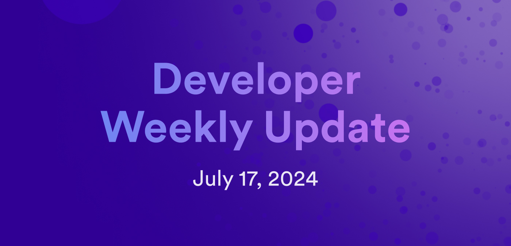

# Developer weekly update July 17, 2024



Hello developers, and welcome to this week's developer weekly update! In this week's update, there is a new release of Agent-js, the first draft of the Bitfinity whitepaper to review, and an exciting forum conversation about AI to participate in. Let's get started!

## Agent-js v2.0.0

A new version of Agent-js has been released! Version 2.0.0 comes with some important, yet backwards *incompatible* changes. These changes support advanced use cases for building libraries with the `HttpAgent`.

The first change deprecates the `HttpAgent` constructor, replacing it with a preference for using `await HttpAgent.create()`. It automatically fetches the root key if you pass `shouldFetchRootKey: true` to the `HttpAgentOptions` for local development, and it will automatically run and configure the `syncTime` method.

The `createSync` method is recommended and preferred for use over accessing the `HttpAgent` constructor going forward:

```
function getActor(options){
-   return new HttpAgent(options);
+   return HttpAgent.createSync(options);
}
```

The second large change in this release makes the `HttpAgent` return more details after making a call. This change is to support the upcoming ICRC-49 standard. Now, `HttpAgent.call` provides:

- `requestId`: The request ID to poll for.
- `response`: The raw `http` response from the boundary node.
- `requestDetails`: Details sent to the canister and used to compute the request ID.

`pollForResponse` was updated as well and now returns:

- `certificate`: The certificate tree sent along with the reply.
- `reply`: The certified response from the replica.

Want to learn more? Check out the [release announcement forum post](https://forum.dfinity.org/t/agent-js-v2-0-0-is-released/33290) or the full [release notes](https://github.com/dfinity/agent-js/releases/tag/v2.0.0) for more information.


## Bitfinity whitepaper

Bitfinity, a team building an EVM on ICP to serve as a Bitcoin layer-2 and deploy advanced Solidity smart contracts as canisters, has released their first whitepaper draft. This whitepaper details the Bitfinity architecture, components, and capabilities of the project.

The team is currently asking for feedback, comments, and questions from the community on the draft. You can read the paper on [GitHub](https://github.com/bitfinity-network/whitepapers/blob/main/Bitfinity_Network.pdf) and leave your comments on the [developer forum](https://forum.dfinity.org/t/first-draft-bitfinity-whitepaper-sharding-evm-on-the-internet-computer/32687).


## Join the conversation: AI on blockchain

What makes AI on blockchain difficult? A community conversation is happening on the forum to answer this question. DFINITY team member Diego Prats drafted a blog post discussing AI on blockchain and has published a draft on the [developer forum](https://forum.dfinity.org/t/what-makes-ai-on-blockchain-hard-request-for-feedback-on-post/32686) to get feedback. So far, several community members have asked great questions, left insightful suggestions for revisions, and created a great conversation to reference and learn from. Check out the blog draft, leave your comments, and participate in the conversation today!

That'll wrap up this week. Tune back in next week for more developer updates!

-DFINITY