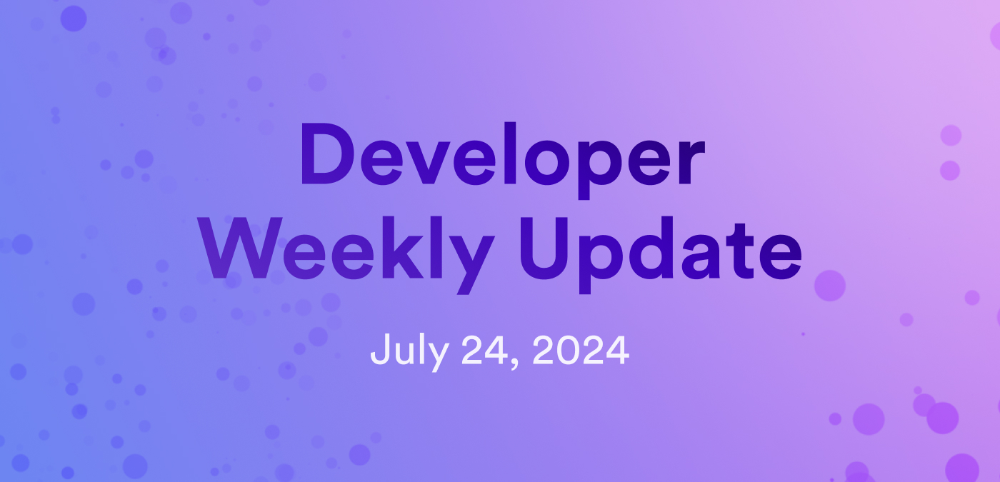

# Developer weekly update July 24, 2024

Hello developers, and welcome to this week's developer weekly update! In this week's update, there is a new release of PocketIC, the release of threshold Schnorr Beta testing on the mainnet, and several new developer docs. Let's get started!

## PocketIC v5.0.0

A new version of PocketIC has been released! Version 5.0.0 introduces several new and exciting features, including:

- ECDSA support, allowing you to use any of the available ECDSA keys with the PocketIC instance of the II subnet.

- PocketIC dashboard, an HTML page that shows all canisters deployed on your PocketIC instance.

- Support for large Wasm files.

- Support for mainnet canister IDs.

- A state directory that preserves the PocketIC instance when PocketIC is restarted.

- Support for testing features that are not available on the mainnet yet.

Want to check out the full release notes? View the [full changelog](https://github.com/dfinity/ic/blob/cec100d1607eb2258441ff292a144ba88564458e/rs/pocket_ic_server/CHANGELOG.md#500---2024-07-22) or check out the [forum discussion](https://forum.dfinity.org/t/pocketic-version-5-0-0-several-new-cool-features/33544).

## Threshold Schnorr

Threshold Schnorr is now available for beta testing on the mainnet! Threshold Schnorr on ICP is an exciting release because it unlocks several new workflows and use cases, such as:

- Support for BIP-340, which is Bitcoin's variant of Schnorr used in ordinals such as BRC-20.

- Support for Ed25519 signatures, which are used by chains such as Solana, Cardano, Polkadot, and Ripple.

- Higher signature throughput than threshold ECDSA signatures.

- Allows canisters to obtain their own Schnorr public key and address, unlocking the ability for them to derive addresses on other chains, then authorize and submit transactions on those chains.

Want to learn more? Check out the [threshold Schnorr overview](/building-apps/network-features/signatures/t-schnorr).

Want to start using threshold Schnorr? [Learn how to sign transactions with t-Schnorr](/building-apps/network-features/signatures/t-schnorr)

To use threshold Schnorr, you will need [`dfx v0.22.0`](https://github.com/dfinity/sdk/releases/tag/0.22.0-beta.0), which is currently still in beta.

## New developer docs

There are a few new developer docs this week, including:

- [System time and timestamps](/building-apps/network-features/time-and-timestamps): Learn about how to use system time, how to convert timestamps into different formats, and how to calculate the difference between two timestamps.

- [Auto-scaling architecture](/home): View an example of how to create a project that auto-scales based on memory usage.

- [Init args](/building-apps/developer-tools/advanced-dfx/init-args): Learn how to use init args and init arg files with `dfx`.

This week, the agent documentation saw some significant revisions, specifically on these pages:

- [JavaScript agent](/building-apps/interact-with-canisters/agents/javascript-agent)

- [Node.js](/building-apps/interact-with-canisters/agents/nodejs)

- [Rust agent](/building-apps/interact-with-canisters/agents/rust-agent)

That'll wrap up this week. Tune back in next week for more developer updates!

-DFINITY