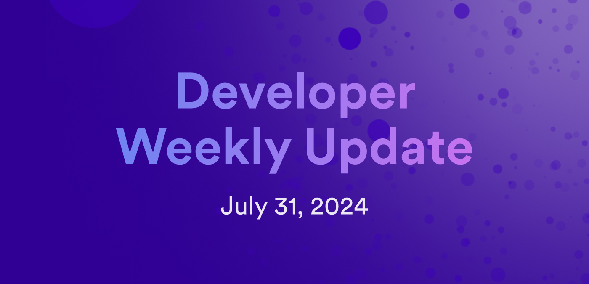

# Developer weekly update July 31, 2024

Hello developers, and welcome to this week's developer weekly update! This week, there is a new release of the Motoko package manager Mops, a new episode of the ICDevs DAO podcast, and another installment of the NNS Explained series. Let's get started!

## Mops `v0.45.0`

Mops v0.45.0 has been released! In this release, there are a few features and bug fixes, such as:

- Fixed an error regarding the cache folder being deleted upon GitHub install.

- Fixed a `moc-wrapper` error for when a `.mops` folder exists.

- Updated dependencies.

- Added a `--no-install` flag to the `mops sources` command.

- Added a `--verbose` flag to the `mops publish` command.

- Added support for dependency version pinning.

You can read the full release notes on the [Mops blog](https://blog.mops.one/2024-07-30-updates).

## ICDevs DAO podcast episode 2

The second episode of the ICDevs DAO podcast has been released! This podcast is part of a project that aims to build software and tools that enhance and assist DAOs deployed on ICP. The project also includes a detailed document that contains information gathered through interviews with different DAOs to identify patterns and forms.

Check out more information on the ICDevs DAO project and the latest podcast episode [on the forum](https://forum.dfinity.org/t/icdevs-org-daos-project/32840).

## NNS Explained | Neuron Following

NNS Explained is a video series that dives into the Network Nervous System that governs ICP, teaching viewers about the different ways they can interact with the NNS and participate in the network's onchain governance. In the latest episode, Neuron Following, Lara Schmid shows how to set up neuron following to maximize your rewards.

Check out the video [on YouTube](https://www.youtube.com/watch?v=6BznC9p3w8w).

That'll wrap up this week. Tune back in next week for more developer updates!

-DFINITY