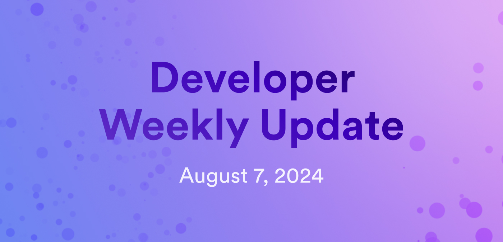

# Developer weekly update August 7, 2024

Hello developers, and welcome to this week's developer weekly update! This week, there is an exciting new beta release of `dfx`, a reminder about the upcoming online ICP DevConf event, info about the Bitcoin Olympics, and new docs on asset security. Let's get started!

## `dfx v0.23.0` beta release

`dfx v0.23.0` has been released for beta testing! This release includes several new features, including:

- `dfx` can now be used to generate `.env` files for Motoko canisters.

- `security_policy` and `disable_security_policy_warning` are now supported in the `.ic-assets.json5` file. This configuration has three options: "hardened," "standard," or "disabled." Learn more about each setting in the [release notes](https://github.com/dfinity/sdk/releases/tag/0.23.0-beta.0).

- The command `dfx info security-policy` returns the headers that get applied to assets as configured in the new `security_policy` setting.

- `dfx extension` can now install extensions from external locations, such as URLs or a .JSON file, rather than just through the extension's name.

- The replica port is now displayed in the output of `dfx start`.

- The flag `--wallet` now accepts an identity name.

- For Rust canisters, crates can be specified in the `dfx.json` file and used for a canister module.

This release also includes bug fixes such as:

- `dfx extension install` does not return an error if the extension is already installed.

- `dfx ledger create-canister` now sets the correct controller principal.

- Error codes are now displayed for some `http-related-errors`.

You can read the full [release notes](https://github.com/dfinity/sdk/releases/tag/0.23.0-beta.0) and install the beta with the command `dfxvm install 0.23.0-beta.3`.

## ICP DevConf

ICP DevConf is a free online developer conference hosted by ICP Hubs USA that will take place later this month, August 27 & 28. The event will feature several live keynotes and workshop presentations from DFINITY team members and the ICP community.

You can [register online](https://icpdevconf.com/) for this event until August 25, 2024.

## Bitcoin Olympics

ICP is a proud sponsor of the Bitcoin Olympics, an online hackathon hosted by Bitcoin Startup Labs! This event begins on August 9, 2024, and will run through the end of September. Participants can enter to win over $100,000 worth of prizes in a variety of different focus areas and tracks, including ICP-specific tracks.

[Learn more and register today](https://btcolympics.devpost.com/) to participate in this great Bitcoin event!

## Asset security documentation

New documentation has been published that details Content Security Policies (CSPs) for asset canisters, security recommendations, and details about changes to the asset canister's default CSP in `dfx` versions newer than `v0.21.0`. You can learn more [on the developer docs](/docs/building-apps/frontends/asset-security).

That'll wrap up this week. Tune back in next week for more developer updates!

-DFINITY
