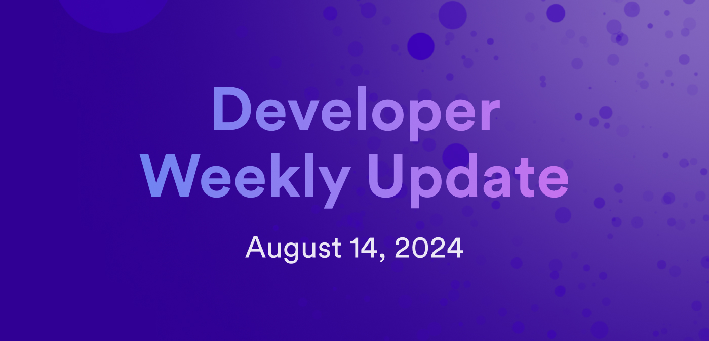

# Developer weekly update August 14, 2024

Hello developers, and welcome to this week's developer weekly update! This week, we're excited to share details about the Deuterium milestone production release, new documentation on digital assets, and an exciting new community project. Let's get started!

## Deuterium milestone: production release

The Deuterium roadmap milestone has been achieved and can now be used for production applications! This important Chain Fusion milestone enables threshold Schnorr signatures to be used by canisters to sign and submit new types of transactions to the Bitcoin network, including transactions for Ordinals, Runes, and BRC-20 tokens. This release also brings Bitcoin block header data to ICP, allowing canisters to obtain more information about transactions and assets on Bitcoin.

Want to learn more? Check out these developer documentation pages for more information and tutorials:

- [Threshold Schnorr](/building-apps/network-features/signatures/t-schnorr).

- [Signing transactions with threshold Schnorr](/build-on-btc/btc-transactions/sign-transactions#signing-transactions-with-threshold-schnorr).

## Digital asset docs

The digital assets section of the developer docs has gotten an overhaul! Before, these docs focused primarily on the ICP and ICRC ledger local development instructions and guides on using Rosetta. Now, these docs include details about the various token standards available, different asset types such as tokens and NFTs, different wallet types and implementations, and more! Here are just a few new pages that we recommend checking out:

- [Token standards](/defi/token-standards/)

- [Asset flow](/defi/overview)

- [Ledger integration options](/defi/token-integrations/)

- [NFT overview](/defi/overview)

- [Creating an NFT collection](/defi/overview)

- [NFT marketplaces](/defi/overview)

- [Wallet overview](/defi/overview)

## Community project release: Moonshift

Moonshift is a new exciting community project designed for ICP projects to create marketing tasks for their community to complete in return for a bounty. Bounties can be set in any ICRC-2 token, such as ckBTC, ckETH, or SNS specific tokens like CHAT. The goal of Moonshift is to help projects curate more community-created content and improve their marketing creativity, reach, and messaging.

Several projects have already posted bounties, including OpenChat, Motoko Sentinels, and ICDevs. Check out the [Moonshift application](https://www.moonshift.app/) and leave your feedback on the [developer forum](https://forum.dfinity.org/t/introducing-moonshift/34121).

That'll wrap up this week. Tune back in next week for more developer updates!

-DFINITY