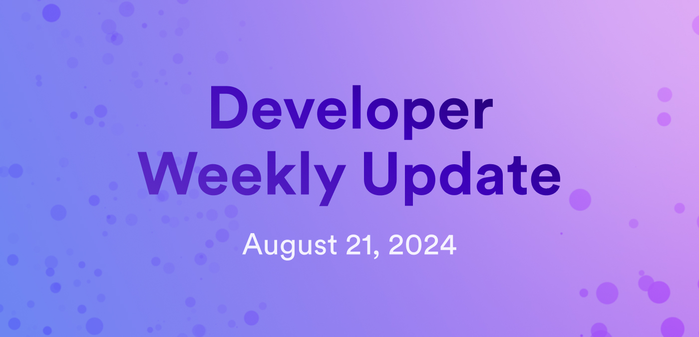

# Developer weekly update August 21, 2024

Hello developers, and welcome to this week's developer weekly update! This week, we're excited to talk about the latest chain-key token launch, a series of proposals regarding grants for known neurons, and the release of the NFID IdentityKit package. Let's get started!

## ckEURC

This week, another new chain-key token was launched on the mainnet! The token, ckEURC, is a digital twin of EURC. EURC is a stablecoin backed by the Euro and issued by [Circle](https://www.circle.com/en/). ckEURC is already supported on different ICP platforms, such as [Plug wallet](https://twitter.com/plug_wallet/status/1825544687337550087).

Bringing popular stablecoins to ICP through chain-key cryptography helps drive further global adoption of dapps built on ICP and facilitates faster, cheaper token transactions for everyday stablecoin use cases.

## Voting neuron grant proposals

On Friday, 28 proposals were submitted that will decide which neurons will receive grants to become voting neurons on the NNS. Voting neurons are neurons that will be trusted to take time to audit and verify each proposal in the category that they are a voting neuron for. The goal of these grants is to incentivize more credible entities to participate as active voting neurons, thus decentralizing the trusted entities that other neurons follow.

The voting period for these proposals has ended, but you can review the results and the corresponding conversation [on the developer forum](https://forum.dfinity.org/t/grants-for-voting-neurons/32721/107).

## NFID IdentityKit release

The NFID team has released a new package called IdentityKit! This package facilitates wallet sign-in, transaction approvals, and global wallet addresses in a single tool.

IdentityKit supports all ICRC wallet standards and currently only supports NFID Wallet. Other wallets, such as Oisy, Plug, and Internet Identity, are on the roadmap for this package. It also supports global addresses and principals from onchain wallets.

[Learn more in the IdentityKit docs](https://docs.identitykit.xyz/) or install IdentityKit today with `npm install @nfid/identitykit@latest`.

That'll wrap up this week. Tune back in next week for more developer updates!

-DFINITY