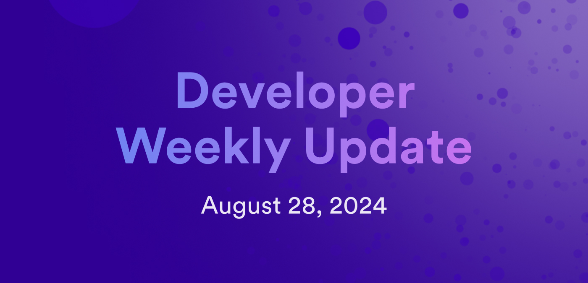

# Developer weekly update August 28, 2024

Hello developers, and welcome to this week's developer weekly update! This week, we're excited to talk about the upcoming Beryllium milestone, a new episode of NNS explained, and a new release of the `ic-siwe` package. Let's get started!

## Beryllium milestone

The Beryllium roadmap milestone is nearing completion and is expected to be released in early October! This milestone is focused on providing canister developer improvements and operation simplifications. Exciting features included in this milestone include:

- Canister logging: Read and write canister runtime logs.

- Canister snapshots: Rollback to previous snapshots to fix errors and recover data.

- Canister lifecycle hooks: Canisters can receive notifications from ICP regarding lifecycle updates, such as low canister balance.

- Actionable error messages and backtraces: Create a standard for response and error codes for better service composability.

- Standardized canister response codes: Enhance error codes by providing actionable items and documentation explaining how to resolve errors.

You can read the full details of this milestone on the [ICP roadmap](https://internetcomputer.org/roadmap#Developer%20Experience-Beryllium). 

## ic-siwe v0.1.0

The `ic-siwe` package enables developers to provide users with the option to login to an application with their Ethereum wallet. The latest release of `ic-siwe` introduces security improvements and reliability. Release notes include:

- Breaking changes to the `prepare_login` and `login` functions.

- Improved security through a nonce-based implementation and validated signature expiration.

- Proper cleanup of SIWE messages through added logic to remove failed login attempts and prevent stale data. 

[Learn more on the developer forum](https://forum.dfinity.org/t/announcing-ic-siwe-v0-1-0-security-fixes-making-nonce-required/34410).

## New episode: NNS explained

A new episode of the NNS explained series has been released! In this episode, [Verifying NNS Dapp Proposals](https://www.youtube.com/watch?v=J-aJFJ_4zIw), you can learn how to build the NNS dapp locally, obtain the proposed Wasm module hash included in a proposal, then verify that the proposed hash matches the hash of the NNS dapp you built and tested locally.

You can learn more about the NNS explained series on the [developer forum](https://forum.dfinity.org/t/announcement-nns-explained-youtube-series/32337/12).

That'll wrap up this week. Tune back in next week for more developer updates!

-DFINITY