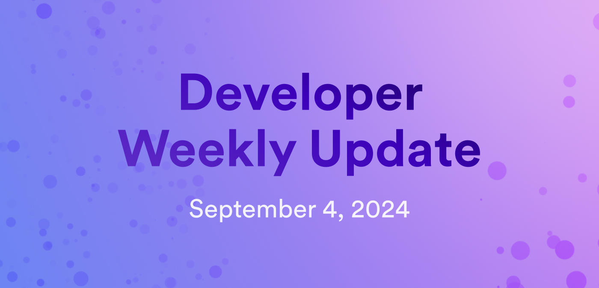

# Developer weekly update September 4, 2024

Hello developers, and welcome to this week's developer weekly update! In this week's update, we're excited to talk about the most recent update to the NNS, highlight an update on the community project Nauts World, and ask for your feedback regarding API changes for public and private neurons. Let's get started!

## August 30, 2024 NNS updates

On August 30, 2024, the following updates were proposed for three of the NNS canisters:

- **Cycles minting canister**: Added more log visibility support, initialized `average_icp_xdr_conversion_rate`, and added support for `wasm_memory_threshold`.

- **Governance canister**: Backfilled Neurons Fund data, removed `SetDefaultFollowees`, `SetSnsTokenSwapOpenTimeWindow`, and `OpenSnsTokenSwap` proposal types, disabled `UpdateAllowedPrincipals` proposal type, and added functionality where deprecated `*_pb` methods now fail.

- **Genesis token canister**: Did not include any new features or fixes, but was updated as a general maintenance procedure.

You can read more about these updates and verify the code for each by checking out the [forum post](https://forum.dfinity.org/t/nns-updates-2024-08-30/34620) with all the details.

## Nauts World update

A new season is starting at Nauts World! Nauts World is a collectible-based game featuring characters known as Nauts that players can mint, trade, and sell. There is exciting new functionality coming to Nauts World soon, including:

- Mobile game: Nauts World will soon have an accompanying mobile game that will provide players a way to strengthen their arsenal of Nauts. 

- NFT utility: Players can redeem a 3D printed variant of their Nauts NFT once certain criteria are met.

- Game lore: Stories about the character's clans will be released to help improve world building and character development.

- Nauts World staking sector will be released.

Want to learn more? Read the full update on the [developer forum](https://forum.dfinity.org/t/nauts-world-season-update/34644/1).

## Request for feedback: API changes for public and private neurons

A request for comments has been opened on the forum regarding changes to the API for public and private neurons. These changes would include breaking changes, and your feedback is appreciated in helping to finalize the decisions regarding these changes. 

Breaking changes would alter how an app reads neurons that do not belong to the caller, i.e., the caller is not a controller or hotkey of the neuron. Specifically, the fields `recent_ballots` and `joined_community_fund_timestmap_seconds` would not work, and would require a new field called `visibility` to properly interpret the values of either of these fields.

Non-breaking changes include:

- Allowing neurons to utilize the new `visibility` field.

- Allow public neurons to be read without special privileges through changes to the `list_neurons` method.

- Known Neurons will always be public.

You can read the full details of these API changes and leave your feedback on the [developer forum](https://forum.dfinity.org/t/request-for-comments-api-changes-for-public-private-neurons/33360/1).

That'll wrap up this week. Tune back in next week for more developer updates!

-DFINITY