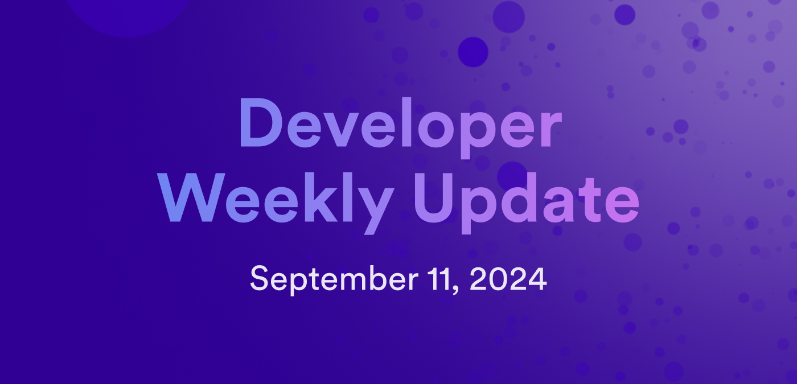

# Developer weekly update September 11, 2024

Hello developers, and welcome to this week's developer weekly update! This week, we're excited to chat about Ed25519 signatures, `dfx v0.23.0`, and a new community project that's leveraging AI onchain. Let's get started!

## Ed25519 signatures

Ed25519 signatures are now available for production use on the mainnet! Ed25519 signatures have been enabled as part of the [threshold Schnorr API method](/references/ic-interface-spec#ic-sign_with_schnorr), and allow ICP canisters to interact with other chains that use an Ed25519 algorithm, such as Solana, Cardano, and Polkadot.

To use Ed25519 signatures, transactions can use the `sign_with_schnorr` API method and be signed with the production key `Ed25519:key_1`.

Enabling Ed25519 signatures is part of the [Helium roadmap milestone](https://internetcomputer.org/roadmap#Chain%20Fusion-Helium), which will also include the launch of a Solana RPC canister.

Check out the [developer preview](https://github.com/domwoe/schnorr_canister) project for an example of how to use Ed25519 signatures.

## `dfx v0.23.0` is promoted!

`dfx v0.23.0` has been released! Notable features and changes in this version of `dfx` include:

- Support for canister snapshots.

- Support for threshold Ed25519 signatures.

- Support for PocketIC's HTTP gateway.

- Added `settings_digest` field to the `network-id` file.

- `dfx extension install` now locates extensions using the extension catalog.

[View the full release notes](https://github.com/dfinity/sdk/releases/tag/0.23.0).

## IChess

An exciting community project using onchain AI has been announced! IChess showcases how a fully functional LLM can run directly on ICP by providing an app where you can play a game of chess against an AI opponent. The AI is trained on an LLM that interprets chess positions and determines the next optimal move. The project uses the LLaMA2 module and a backend written in C++.

[Learn more about IChess](https://forum.dfinity.org/t/ai-player-on-icp-ichess/34839) or [play a game yourself](https://cirh4-aiaaa-aaaan-qmvqa-cai.icp0.io/)!

That'll wrap up this week. Tune back in next week for more developer updates!

-DFINITY
