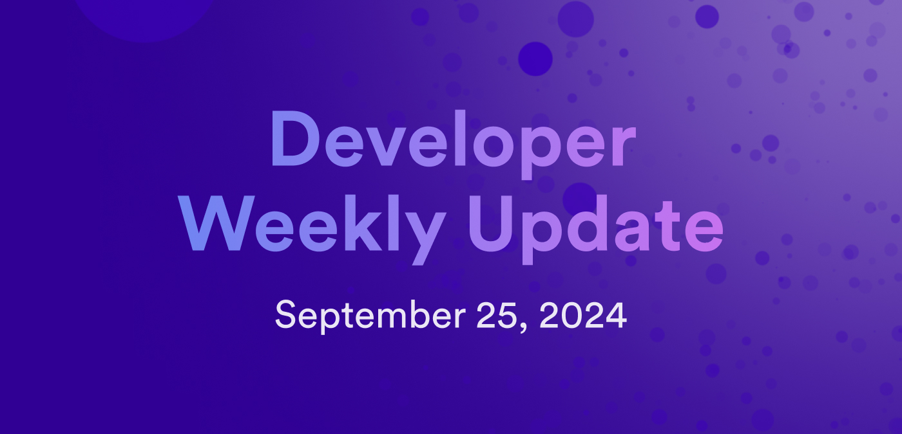

# Developer weekly update September 25, 2024

Hello developers, and welcome to this week's developer weekly update! In this week's update, there is a new ICRC standard draft open for community review and feedback, an NNS proposal to upgrade subscription utility, and a new data visualizer that demonstrates the current ICP and cycle burn rates. Let's get started!

## ICRC-72: Minimal event-driven pub-sub standard

A new ICRC standard has been created by the token standards working group and is ready for review and feedback from the community. This standard, known as ICRC-72, defines a standard for the publish-subscribe messaging pattern on ICP.

The publish-subscribe pattern, often referred to as pub-sub, allows distributed system components to exchange information asynchronously. It uses an event-driven approach that ICRC-72 leverages to provide a standard mechanism where a canister can subscribe to a specific type of message and respond to them without requiring a poll or maintaining a direct link to the origin of the message.

The ICRC-72 standard defines how different roles, such as publisher, subscriber, broadcaster, and orchestrator, interact with one another in the ICP ecosystem by detailing the methods, protocols, and data structures necessary to establish secure and effective communication.

You can read the draft of the standard on [GitHub](https://github.com/icdevs/ICEventsWG/blob/main/draft_proposals_current/candidate-ICRC72-20240924.md) and leave your feedback or questions on the [developer forum](https://forum.dfinity.org/t/icrc-72-minimal-event-driven-pub-sub-standard-candidate-draft/35489).

## NNS proposal: Upgrade NNS subscription utility

A proposal has been submitted to the NNS that upgrades the NNS subscription utility canister `fe5iu-uiaaa-aaaal-ajxea-cai`. This proposal includes the following changes:

- Upgrades the utility to ICRC-79, which fixes query processing, bugs regarding deduping transaction code, and adds fields to the product object.

- Reruns the blockchain from Genesis to remedy an error regarding a typo in an item.

- Adds `ICRC3_supported_block_types`.

You can learn more about this proposal and leave your feedback on the [developer forum](https://forum.dfinity.org/t/proposal-to-upgrade-nns-subscription-utility-fe5iu-uiaaa-aaaal-ajxea-cai/35500).

## ICP burn speed visualizer

It's no secret that the ICP cycles burn rate has been going to the moon recently, with projects like [bob.fun](https://bob.fun/) and [Burn](https://burn.msq.tech/) gaining popularity. Want to get a better idea of how fast the burn rate actually is?

The ICP burn speed visualizer tool does just that! Using a simple, open-source interface, you can see a real-time visualization of the current burn rates for both cycles and ICP. The visualizer also shows the rate at which cycles and ICP tokens are being minted, so you can compare the rate of minting to the rate of burning.

[Check out the visualizer yourself](https://ic.tago.so/) or view the [open-source code](https://observablehq.com/@tagoso/icp-burn).

That'll wrap up this week. Tune back in next week for more developer updates!

-DFINITY