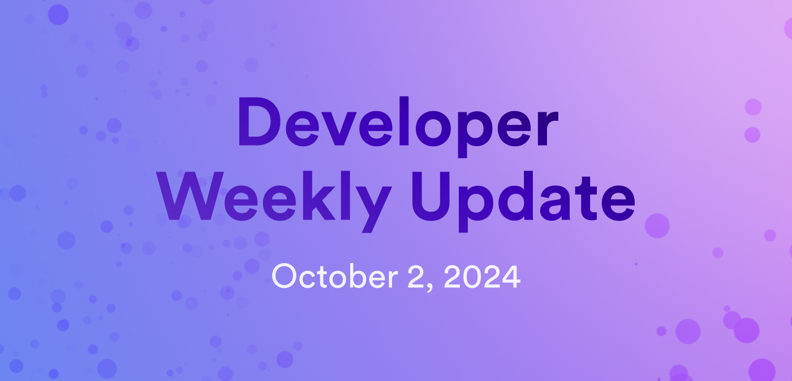

# Developer weekly update October 2, 2024

Hello developers, and welcome to this week's developer weekly update! In this week's update, we're excited to announce a new tool for calculating project costs, `dfx v0.24.0`, and two new ICRC standards that are being discussed by the community. Let's get started!

## ICP pricing calculator

Curious what your project may cost once deployed on ICP? The new ICP pricing calculator now provides you with a way to estimate dapp costs depending on:

- Number of canisters
- Amount of storage
- Additional features used, such as HTTPS outcalls, ECDSA, query calls, update calls, and more.

Costs are estimated in USD, but will be charged to your canister(s) in cycles. The calculator differentiates between one-time costs and reoccurring costs.

Check out the [pricing calculator](https://3d5wy-5aaaa-aaaag-qkhsq-cai.icp0.io/) or learn more [paying for resources in cycles](/building-apps/essentials/gas-cost).

## dfx v0.24.0

`dfx v0.24.0` has been released! This version includes several notable features and bug fixes, such as:

- Canister upgrade options are exposed in the CLI as the options `--skip-pre-upgrade` and `--wasm-memory-persistence`.
- `dfx deploy --mode` now accepts "install", "reinstall", "upgrade" and "auto" as possible options.
- Motoko stable compatibility warnings are now reported.
- PocketIC replica state is now persisted between runs.
- `dfx extension list` now displays all available extensions.

## ICRC-75 and ICRC-104

There are two new ICRC standard drafts ready for community review and discussion! ICRC-75 provides a minimal membership standard, while ICRC-104 defines a rule-based membership manager standard.

ICRC-75 defines the data structures and types for representing identities, permissions, and lists associated with composable identity lists on ICP. Specifically, ICRC-75 defines permissions that an identity or list can obtain and use to execute actions on other lists. Using these permissions, ICRC-75 can be used to manage access and actions that can be executed by different identities across different lists within the ICP ecosystem.

You can review the [ICRC-75 draft](https://github.com/icdevsorg/icrc75.mo/blob/main/icrc75-standard.md) or participate in the [discussion on the forum](https://forum.dfinity.org/t/icrc-75-minimal-membership-standard/35753).

ICRC-104 defines a membership manager standard for manipulating memberships within the lists defined by ICRC-75. It allows developers to create adaptable and scalable applications using customizable rule sets for membership lists, manipulating lists through role rotation, house sorting, and other membership-related functions.

You can review the [ICRC-104 draft](https://github.com/dfinity/ICRC/issues/104) or participate in the [discussion on the forum](https://forum.dfinity.org/t/icrc-104-rule-based-membership-manager-standard/35756).

That'll wrap up this week. Tune back in next week for more developer updates!

-DFINITY