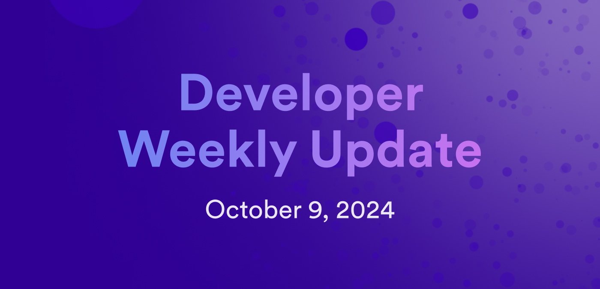

# Developer weekly update October 9, 2024

Hello developers, and welcome to this week's developer weekly update! In this week's update, there are several new documentation pages on the ICP dev docs, an update about developer office hours on Discord, and a community spotlight for the app KongSwap. Let's get started!

## Documentation updates

Over the past few weeks, several new documentation pages have been added to the dev docs! Here are the latest updates:

- [Smart contract testing overview](/building-apps/test/overview)

- [Canpack developer tool](/motoko/motoko-tooling/canpack)

- [AI inference](/ecosystem?tag=AI)

- [ICP dashboard overview](https://dashboard.internetcomputer.org/)

- [Using the ICP dashboard](https://dashboard.internetcomputer.org/)

- [ICP dashboard APIs](/references/dashboard-apis)

- [Cycles pricing calculator](/building-apps/essentials/gas-cost)

Check out all of the [ICP developer documentation](/building-apps/essentials/network-overview).

## ICP developer office hours

Developer office hours are back in the ICP developer Discord server! Every Wednesday, two office hour sessions are held in the Discord server's voice chat:

- 7:00 UTC
- 17:30 UTC

Be sure to drop in to the session and ask questions, share your project, or simply listen in on the discussion.

[Join the ICP developer Discord server](https://discord.internetcomputer.org).

## Community spotlight: KongSwap

KongSwap is a decentralized exchange that utilizes ICP's Chain Fusion technology to facilitate cross-chain trading without using a bridge or oracle. KongSwap offers a better, simplified user experience through features such as lower fees and decreased liquidity fragmentation. It is a fully decentralized platform deployed entire onchain with both the frontend and backend components hosted on ICP as canisters.

You can [try KongSwap yourself](https://www.kongswap.io/?viewtab=swap&pool=ICP_ckUSDT) or learn more about the app's architecture, design, and features on the [developer forum](https://forum.dfinity.org/t/introducing-kongswap/35607).

That'll wrap up this week. Tune back in next week for more developer updates!

-DFINITY
