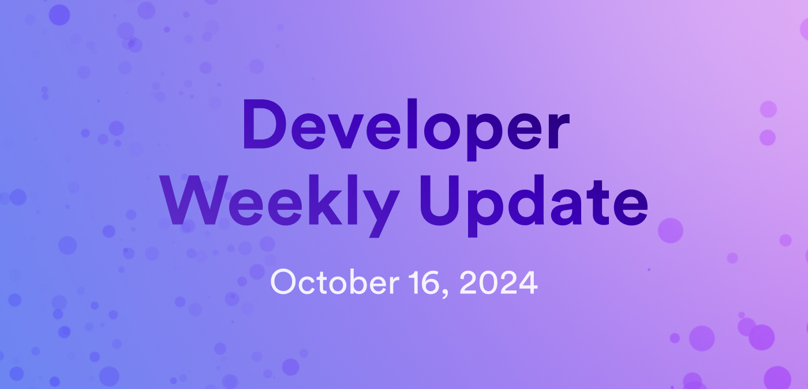

# Developer weekly update October 16, 2024



Hello developers, and welcome to this week's developer weekly update! In this week's update, there is a new release of the `dfx` SNS extension, a new `dfx` beta version, and best-effort responses are now available for beta testing. Let's get started!

## dfx SNS extension version 0.4.6

A new release of the `dfx` SNS extension is available! In the latest version, `0.4.6`, a new command has been added: `dfx sns health`. Running this command will display a dashboard that includes essential health metrics for every SNS. These metrics include cycles usage, memory usage, and if the SNS is behind the latest SNS release. All SNSes are shown on this dashboard, making it easy to view the information for ones you're interested in.

You can install this `dfx` extension with the command:

```
dfx extension install sns --version 0.4.6
```

## Best-effort responses

Best-effort responses are now supported in `dfx` version 0.24.1-beta.1 and can be used for experimentation locally. They are not currently supported on the mainnet.

Best-effort responses provide two immediate benefits:

- Untrusted canisters can be called safely. The callee cannot make a canister wait indefinitely for a response, meaning a canister will not be prevented from stopping or being safely upgraded.

- Canister call times can now be predicted.

There are a few use cases that need caution when using best-effort responses, however, including:

- Calls where the callee executes a state change, such as a token transfer, must be careful to ensure that the call is either safely retired or the results are obtained.

- Cycles transfers must be careful that if a timeout occurs, cycles will be lost.

You can learn more, ask questions, or provide your feedback about best-effort responses on the [developer forum](https://forum.dfinity.org/t/scalable-messaging-model/26920/67?u=oggy).

## dfx 0.24.1-beta.1

A new beta release of `dfx` is available for testing! This release includes support for:

- Artificial delay and HTTP outcalls for PocketIC.

- Motoko enhanced orthogonal persistence.

- Best-effort responses.

- Canister panic backtraces.

Read the full [release notes](https://github.com/dfinity/sdk/releases/tag/0.24.1-beta.1) or participate in the discussion on the [developer forum](https://forum.dfinity.org/t/dfx-0-24-1-beta-1-is-released/36091).

That'll wrap up this week. Tune back in next week for more developer updates!

-DFINITY