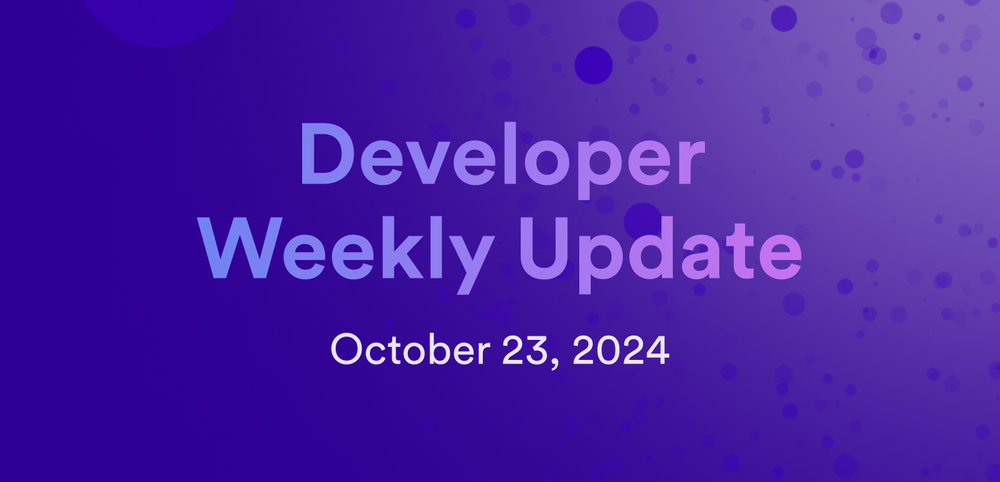

# Developer weekly update October 23, 2024

Hello developers, and welcome to this week's developer weekly update! In this week's update, we have new tooling updates for the ICP JavaScript agent and dfx, community discussions on proposed changes to the Bitcoin integration and a new ICRC standard, and an upcoming ICP hackathon. Let's get started!

## Tooling updates

### ICP JavaScript agent `v2.1.3`

A new release of the ICP JavaScript agent is available! `v2.1.3` focuses on fixes and error handling adjustments, including:

- Fixed `read_polling` request failures where the request failed after the initial expiration but before the request was processed.

- Regression check when calling the management canister using `sync_call`.

- New `ActorCallError` class.

- Fixed `reject_code` and `reject_message` not being passed correctly in synchronous call reject or trap responses.

- Support for `AgentError` and `AgentCallError` `instanceof` checks.

[View the full release notes](https://github.com/dfinity/agent-js/releases/tag/v2.1.3) or leave your feedback on the [developer forum](https://forum.dfinity.org/t/agent-js-2-1-3-is-released/36473).

### `dfx v0.24.1` promoted

`dfx v0.24.1` is now promoted! This release includes:

- Support for the PocketIC flags: `--artificial-delay`, `subnet_type` and `--enable-canister-http`.

- Motoko enhanced orthogonal persistence.

- Best-effort responses.

- Canister panic backtraces.

[Read the full release notes](https://github.com/dfinity/sdk/releases/tag/0.24.1).

### `dfx v0.24.2` beta

`dfx v0.24.2` is now available for beta testing! This version includes:

- Support for the canister log allowed viewer list. Specified users can view a canister's logs without being a controller of the canister.

- Support for batch upload assets. Frontend canisters now try to batch multiple small content chunks into a single call using the `create_chunks` method.

- Support for Motoko `0.13.2`.

[View the full release notes](https://github.com/dfinity/sdk/releases/tag/0.24.2-beta.0).

## Community discussions

There are some notable community discussions happening on the developer forum! These include:

- [Proposed Bitcoin integration changes](https://forum.dfinity.org/t/direct-integration-with-bitcoin/6147/729): Proposal to deprecate the Bitcoin API and advise developers to call Bitcoin canisters directly, migrate control of the Bitcoin testnet to DFINITY, and update the Bitcoin testnet canister from using testnet3 to testnet4.

- [Request for feedback: ICRC-97](https://forum.dfinity.org/t/request-for-feedback-icrc-97-nft-metadata-standard/36423): ICRC-97 proposes a standard for NFT metadata, providing a minimum standard for wallets and marketplaces to display NFTs.

## United Nations Coding4Integrity Hackathon

The United Nations Coding4Integrity Hackathon begins this Friday, October 25th, and runs through November 3rd. This virtual hackathon has two tracks that hackers can enter: AI and NFTs. Hackers can build for as long or as little as they'd like during the hackathon and enter to win a prize from the pool of $70,000.

[Learn more or register today!](https://knowledgefound.org/hackathons/virtual/2024/)

That'll wrap up this week. Tune back in next week for more developer updates!

-DFINITY