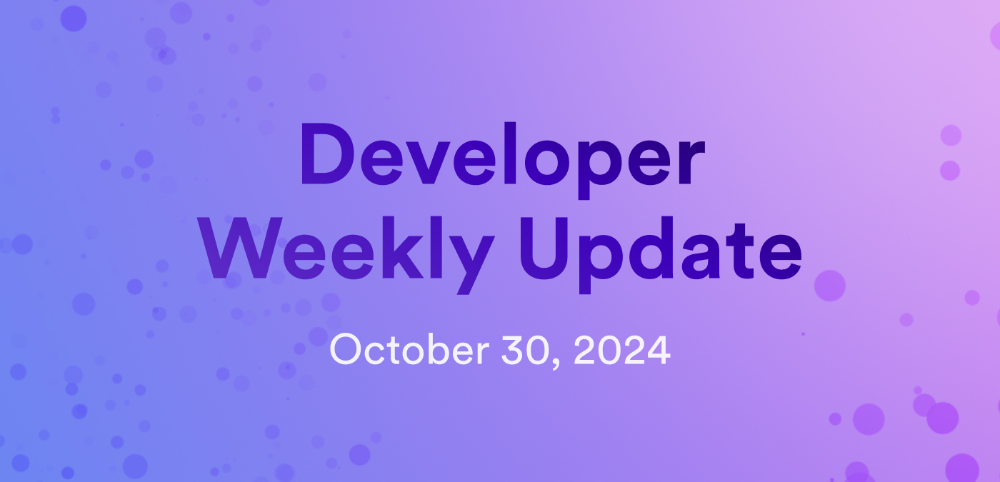

# Developer weekly update October 30, 2024

Hello developers, and welcome to this week's developer weekly update! This week, there are several exciting and important discussions happening on the ICP developer forum. In this update, we'll cover the suggested changes to improve the network's scalability and reduce latency, an increase in cycles cost, and a new design for SNS proposals. Let's get started!

## Discussion: Suggestions to reduce latency and improve network scalability

In recent weeks, certain ICP subnets have seen an increase in subnet load. This increase has resulted in periods of high latency for canisters to send and receive messages and has led to a degraded user experience. It has also opened discussions about the network's plans for scalability.

To reduce latency on subnets with higher loads and improve the overall scalability of the network, DFINITY has proposed the following changes be considered:

- Remove heartbeats from SNS canisters.
- Focus on improvements to the replica.
- Make adjustments to the cost of resources on the network by increasing the cycles cost.
- Add new subnets.

[Check out the discussion on the forum](https://forum.dfinity.org/t/suggested-measures-to-reduce-latency-and-improve-icp-scalability/36564).

## Proposed cycles increase

One of the proposed changes to improve network scalability is to increase the cycles cost of some resources. This proposal is to ensure that the pricing for network usage accurately reflects the operational costs. Specifically, this proposed increase would make changes to:

- The message base fee: Increase from 590K to 5M cycles.
- Instruction fee: Increase from 0.4 to 1 cycle.
- Canister installation fee: Increase from 0.1T to 0.5T cycles.

If these increases are approved by the NNS and implemented, the estimated impact will range from a 15% to 70% cost increase for applications.

[Join the discussion and leave your thoughts in the forum thread](https://forum.dfinity.org/t/evaluating-compute-pricing-in-response-to-increased-demand-on-the-internet-computer-protocol/36565/1).

## Changes to SNS proposals

SNS proposal voting is critical for SNSes to apply important changes or add new features. Each SNS can define custom proposal types to fit the needs of their community. If some SNSes have hundreds of proposal types, it can be hard for SNS users to setup proposal following for each proposal type.

To make SNS proposal following easier, DFINITY is proposing to allow SNS proposal types to be grouped into proposal topics, similar to how the NNS groups proposals by topic. In this design, built-in and custom proposals could be within the same topic, and a topic can be defined as 'critical', setting all proposals within that topic as 'critical' proposals.

Want to learn more? [Read the full details](https://forum.dfinity.org/t/sns-topics-design/36779).

That'll wrap up this week. Tune back in next week for more developer updates!

-DFINITY