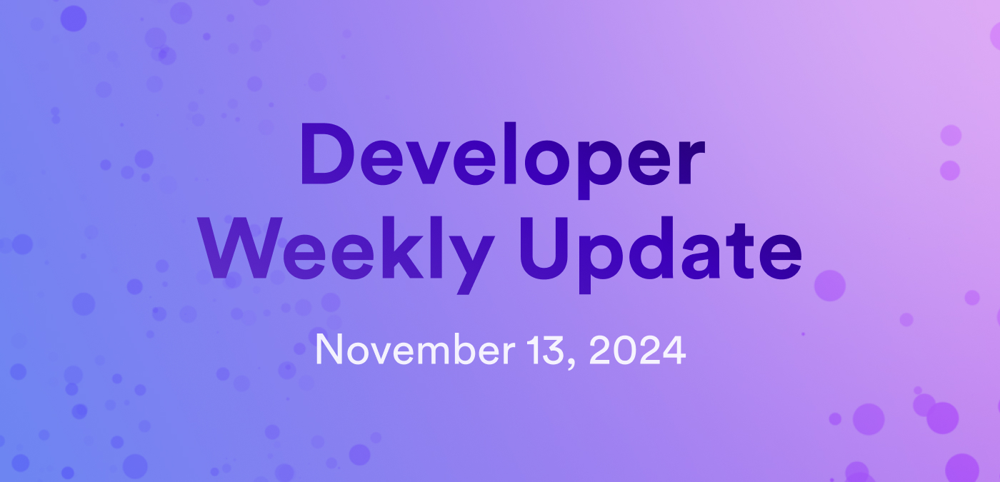

# Developer weekly update November 13, 2024

Hello developers, and welcome to this week's developer weekly update! This week, we have three roadmap milestone releases, Tokamak, Beryllium, and Stellarator, changes to the periodic confirmation feature, and information about upcoming support for BIP341 taproot signatures. Let's get started!

## Roadmap milestones: Tokamak, Beryllium, and Stellarator

This week, ICP has achieved three huge, highly anticipated roadmap milestones! Tokamak, Beryllium, and Stellarator each bring new features and capabilities to the network, bringing Web3 users closer than ever to Web2-level performance and scale.

Tokamak signifies enhancements to end-to-end latency calls through abortable broadcast over QUIC, improvements to the Boundary Node routing logic, and synchronous update calls. The team wrote a fantastic [blog post](https://medium.com/dfinity/tokamak-accelerating-the-internet-computer-update-call-lifecycle-f82517472709) with all the details and some latency statistics.

Beryllium includes several developer experience enhancements, several of which have been requested by the dev community for quite a while. These include canister snapshots, canister logging, backtraces, errors, and standardized response codes. [More info](https://medium.com/dfinity/elevating-the-devops-experience-on-icp-with-beryllium-785db231e4dd) can be found on the blog as well.

Lastly, the Stellarator milestone unlocks 1 TiB of memory *per subnet*, enabling several new data-rich use cases that may have been previously limited by storage constraints. Stellarator contains three important components, each with a [dedicated blog post](https://medium.com/dfinity/a-journey-into-stellarator-part-1-c3e0a2f2e4e7).

Curious what's next? Check out the full [ICP roadmap](/roadmap).

## Periodic confirmation changes

A forum post has been released that details proposed changes to the NNS periodic confirmation feature. Within this proposal, there are changes to the API that would add a new field to neurons called `voting_power_refreshed_timestamp_seconds` which indicates when the neuron last voted, set following, or confirmed following.

You can read more about these proposed changes on the [ICP developer forum](https://forum.dfinity.org/t/periodic-confirmation-api-changes-release-plan/37237).

## Upcoming BIP341 Taproot support

ICP recently rolled out support for threshold Schnorr signatures, including BIP-340 Schnorr. This support did not include BIP-341, also known as Taproot.

The IC interface specification has drafted an extension of the `sign_with_schnorr` interface to support BIP-341. You can [review the interface spec draft](https://github.com/dfinity/interface-spec/pull/344) for more information.

That'll wrap up this week. Tune back in next week for more developer updates!

-DFINITY