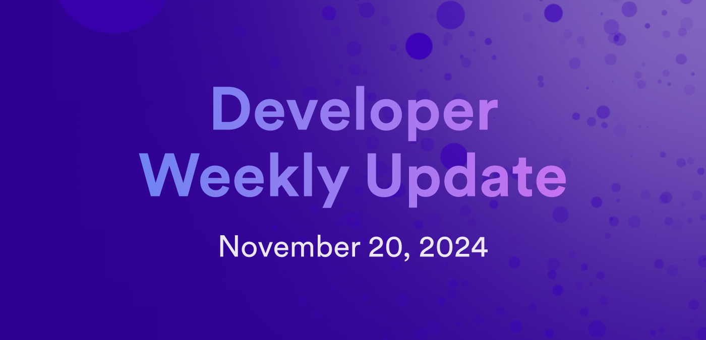

# Developer weekly update November 20, 2024

Hello developers, and welcome to this week's developer weekly update! This week, we have tooling updates for PocketIC, dfx, and Motoko. Let's get started!

## PocketIC 7.0.0

A new version of PocketIC has been released! This version is packed with new features, including:

- Windows support for using the Rust library natively on Windows if Windows Subsystem for Linux (WSL) is installed.

- New server endpoint: `/instances/<instance_id>/_/topology`

- New Rust library module for using the management canister: `pocket_ic::management_canister`.

- Bitcoin integration support via the management canister.

[Read more on the forum](https://forum.dfinity.org/t/pocketic-version-7-0-0-bitcoin-integration-and-windows-support/37344).

## `dfx v0.24.2`

The latest version of `dfx` has been released this past week. This release includes new features such as:

- All commands will use the `DFX_NETWORK` environment variable by default if it is set. The `--network` flag will take precedence if provided.

- `dfx generate` honors the `--network` flag.

- Support for the canister log allowed viewer list.

[Read the full release notes](https://github.com/dfinity/sdk/releases/tag/0.24.2).

## Motoko v0.13.2

The most recent version of Motoko enables an actor's self identifier to be available in the top-level block, allowing functions to refer to self from the initializer.

[Read the full release notes](https://github.com/dfinity/motoko/releases/tag/0.13.2).

That'll wrap up this week. Tune back in next week for more developer updates!

-DFINITY