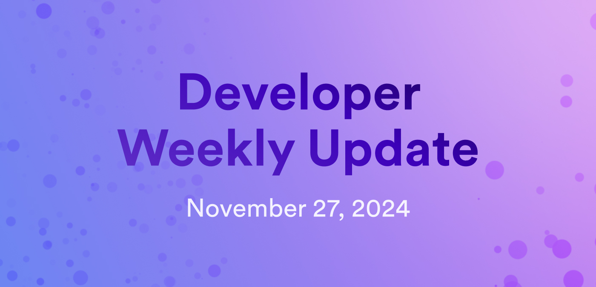

# Developer weekly update November 27, 2024

Hello developers, and welcome to this week's developer weekly update! This week we have two community projects to showcase, Toolkit and Linkpin, and a reminder about developer office hours in the ICP Discord. Let's get started!

## Toolkit

Toolkit is a dapp management platform with an initial focus on providing tooling for Service Nervous System (SNS) projects. It is designed to simplify dapp development, deployment, scaling, and collaboration. It provides tools to interact with SNS treasuries, mechanisms, and proposals. Developers can also use Toolkit to experiment with dapp governance and management.

[Learn more about Toolkit](https://docs.ic-toolkit.app/docs/intro).

## Linkpin

Linkpin is an onchain bookmark manager, enabling you to login with Internet Identity, save a URL as a bookmark, and then reference that bookmark at a later time. Bookmarks can be managed by alphabetical order, number of clicks, or the last time you visited them. Linkpin utilizes ICP for all data storage and uses a backend written in Motoko.

Linkpin is open source and fully customizable. Check out the code on [GitHub](https://github.com/tagoso/linkpin) for more information.

## Developer office hours

Every Wednesday, the ICP Discord server hosts two office hour sessions: 9 AM CET (8 AM UTC) and 10:30 AM PST (18:30 UTC). Each office hour is hosted in a drop-in style, enabling you to drop into the conversation as you please.

Join the ICP Developer Discord: https://discord.internetcomputer.org/

That'll wrap up this week. Tune back in next week for more developer updates!

-DFINITY