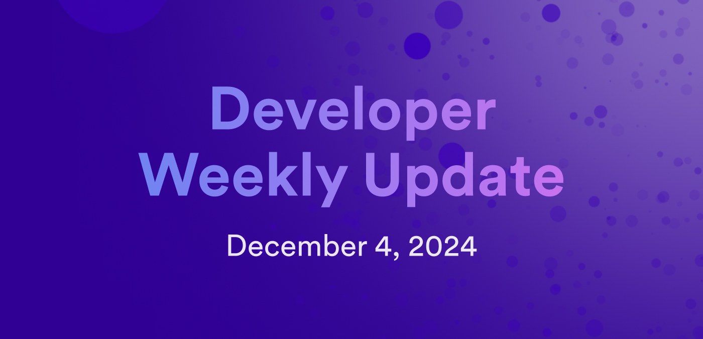

# Developer weekly update December 4, 2024

Hello developers, and welcome to this week's developer weekly update! This week we have a new release of `dfx`, an important update about the Bitcoin integration, and an update from the community project Juno. Let's get started!

## dfx v0.24.3

The latest version of `dfx` is now promoted! This latest update includes new features such as:

- PocketIC now supports Bitcoin through the `--enable-bitcoin` and `--bitcoin-node` flags.

- The canisters for the ICP, ckBTC, and ckETH ledger canisters can now be pulled.

- The frontend canister now supports setting canister permissions in the init arguments.

- Output for `dfx start` and `dfx cycles` have been improved. 

[Read the full release notes](https://github.com/dfinity/sdk/releases/tag/0.24.3).

## Bitcoin integration updates

The Bitcoin Testnet API is being migrated from Testnet v3 to Testnet v4. To support this work, the ckTestBTC minter has been stopped and the Bitcoin Testnet API has been disabled. Once the migration has finished, these features will be re-enabled.

You can stay up to date on the status via the [forum](https://forum.dfinity.org/t/direct-integration-with-bitcoin/6147/743?u=cryptoschindler).

## Juno v0.0.39

A new version of Juno has been released! This latest version introduces backups to Juno through the new ICP canister snapshot feature. Backups are available through both the Juno API and the Juno CLI tool.

[Learn more in the Juno release notes](https://github.com/junobuild/juno/releases/tag/v0.0.39).

That'll wrap up this week. Tune back in next week for more developer updates!

-DFINITY