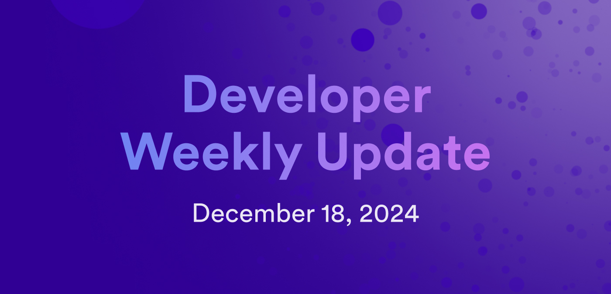

# Developer weekly update December 18, 2024

Hello developers, and welcome to this week's developer weekly update! This week, we're going to take a look at the road ahead for ICP developers in 2025 and dive into some roadmap items and ongoing initiatives that we'll see take the stage in the new year. Let's get started!

## Roadmap milestones

In 2025, ICP will work toward several roadmap milestones, including:

- Flux: Focused on increasing network compute capacity and scalability, Flux plans to implement asynchronous checkpointing and canister migration between subnets.

- Ignition: Part of the decentralized AI roadmap, the Ignition milestone will expand compute and memory capabilities of canisters.

- Helium: Next up in the Chain Fusion roadmap is an integration with Solana through a Solana RPC canister.

- Niobium: The long-awaited vetKeys feature enabling decentralized key management.

You can view details about the roadmap on [internetcomputer.org](https://internetcomputer.org/roadmap).

## Decentralized AI: DeAI Manifesto

Decentralized AI on ICP is just getting started and will be a major topic of conversation and development in 2025. Recently, the DeAI working group put together the [DeAI Manifesto](https://deaimanifesto.com/), a set of parameters and values that they believe will drive decentralized AI across all ecosystems—not just ICP. Some of these values include:

- DeAI is safe AI.

- DeAI is responsible AI.

- DeAI is verifiable. AI

You can read and sign the [DeAI Manifesto](https://deaimanifesto.com/) to participate in DeAI on ICP.

## ICP developer ecosystem growth

In the [Electric Capital 2024 Developer Report](https://www.developerreport.com/developer-report), the ICP developer community ranked highly across several different statistics, including:

- In 2024, ICP was the third largest ecosystem for new developers.

- In 2024, ICP was the second highest chain for full-time developer growth.

- In Africa, ICP was the third most popular blockchain ecosystem.

More details can be found [on X](https://x.com/dfinity/status/1867619158906876252).

That'll wrap up this week and this year! Tune back in 2025 for more developer updates!

-DFINITY

