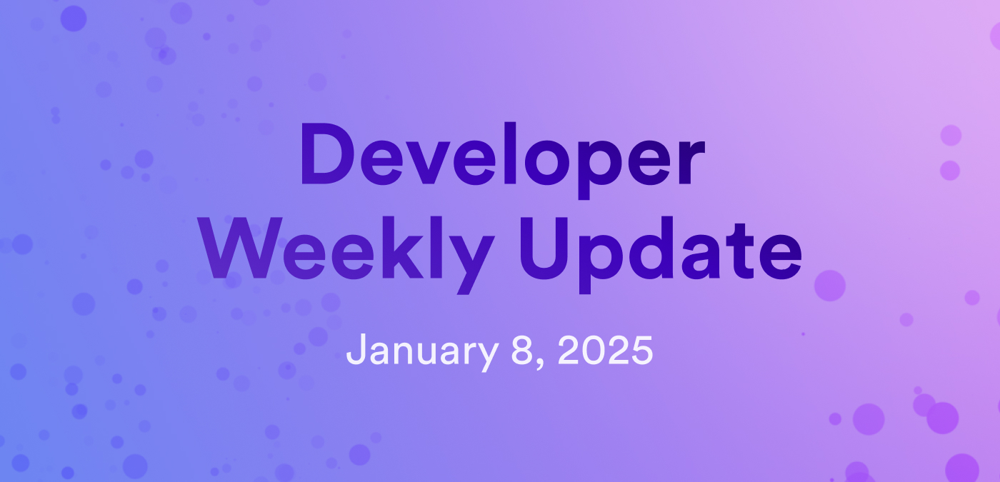

# Developer weekly update January 8, 2025

Hello developers, and happy New Year! To kick off the year, we have some exciting updates regarding the Motoko base library and ICP Ninja, plus a community conversation regarding ICRC-99 and ckNFTs. Let's get started!

## Motoko base library changes

The Motoko base library is undergoing some major changes to improve the readability of Motoko code and improve consistency. The first draft of the new API is available for the community to review and provide their input on, and it is highly recommended that you weigh in on the conversation now.

Check out the [new Motoko base library repo](https://github.com/dfinity/new-motoko-base) and view the [discussion tab](https://github.com/dfinity/new-motoko-base/discussions) to comment on proposals or submit your own improvements to the library.

## ICP Ninja updates

[ICP Ninja](https://icp.ninja/) has some exciting new features to enhance the web-based IDE. Some of these updates include:

- Ask AI: Chat with the ICP AI assistant directly in ICP Ninja to get info about ICP concepts, ask questions about your code, or provide the AI code to debug. Select from a variety of follow-up questions to continue the learning experience and continue to develop your skills!

- New IDE design that includes support for multiple tabs, a preview of the project's frontend, and a preview of the interfaces exposed by the backend canister.

- Syntax error highlighting for Motoko.

- Package loading with linting.

- Updates to the Hello, world! example to include orthogonal persistence.

You can learn more about these updates [on the forum](https://forum.dfinity.org/t/icp-ninja-christmas-market-release/39118) or try ICP Ninja out for yourself at [https://icp.ninja](https://icp.ninja)

## Community discussion: ICRC-99 and ckNFTs

A community conversation has been initiated on the forum regarding ckNFTs and the ICRC-99 standard. ckNFTs are a type of NFT that has been ported from an EVM chain onto ICP. In the code's current state, each source smart contract from the EVM chain would receive its own ckNFT canister that uses the ICRC-7, ICRC-37, and ICRC-3 standards. Once the NFT is on ICP, it can be cast to another EVM chain via the ICRC-99 standard, which sets parameters for casting to other networks.

One example of how this might be used is:

- An NFT is minted on Ethereum.
- The NFT is ported to ICP and is held in its ckNFT canister.
- The owner sells it on an ICRC-7 marketplace on ICP.
- The buyer ports the NFT to Base, and then they can list it on another marketplace such as OpenSea.

The developers working on this concept, ICDevs.org, have opened up the conversation to ask for community ideas, feedback, and creative solutions to some of the issues they're currently experiencing.

[Join the discussion](https://forum.dfinity.org/t/discussion-icrc-99-and-cknfts/39480).

That'll wrap up this week. Tune back in next week for more developer updates!

-DFINITY