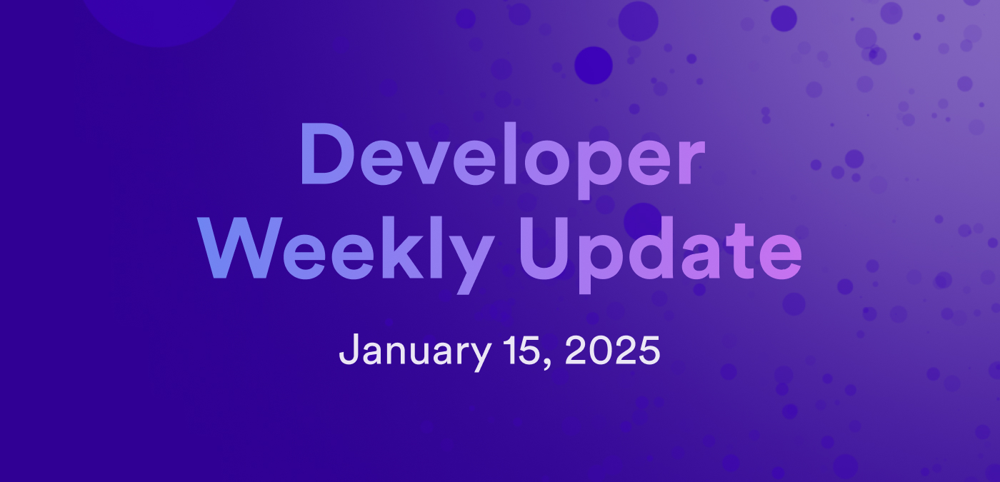

# Developer weekly update January 15, 2025

Hello developers, and welcome to this week's developer weekly update! This week, we have a roadmap milestone release, a few new tooling releases, and an important announcement about ETH Denver 2025. Let's get started!

## Plasma release: Governance milestone

The first milestone of 2025 has been achieved! The Plasma milestone includes several new features on the NNS and new proposal types for deployed SNSes. Features in this milestone include:

- Neurons table design: New design for viewing neuron information.

- Actionable proposals: Clearly see which proposals you can still vote on.

- SNS name and logo change proposals: SNSes can now change their name and logo via proposal.

- Canister-controlled neurons: New functionality for canisters to control a neuron.

- Periodic confirmation: Facilitating active governance participation by periodically asking neurons to confirm their following configuration.

- ICRC-1 token imports: Import any token that supports the ICRC-1 standard to the NNS.

- Neuron visibility settings: Neurons can now be public or private. Public neurons can decide which information they expose about themselves.

- Improved SNS upgrades.

You can learn more about this milestone on the [ICP roadmap](https://internetcomputer.org/roadmap#Governance%20&%20Tokenomics-Plasma) or check out the [milestone release livestream](https://www.youtube.com/watch?v=W01GOBBVY1w).

## Tooling releases

A few new tooling releases are available:

- `ic-repl` v0.7.7: https://github.com/dfinity/ic-repl/releases/tag/0.7.7

- Candid v0.10.12: https://github.com/dfinity/candid

- Internet Identity: https://github.com/dfinity/internet-identity/releases/tag/release-2025-01-10

- `ic-wasm` v0.9.3: https://github.com/dfinity/ic-wasm/releases/tag/0.9.3

## ETH Denver 2025

ICP will be at [ETH Denver 2025](https://www.ethdenver.com/) and would love to see you there! For our developer ecosystem, we're offering some exciting opportunities to showcase your project during the event, including:

- Pitch opportunities: Demo your project at different side events that are sponsored by ICP.

- Booth space: Chat with event attendees at the ICP booth, give live demos, or pass out merch.

If you're interested in participating in either opportunity, fill out the [Google Form](https://docs.google.com/forms/d/e/1FAIpQLSdqWNBRiy-rW2uLt7lhW9am5a6NWidT956oBLrUjkV9gEOTJw/viewform) to let us know!

That'll wrap up this week. Tune back in next week for more developer updates!

-DFINITY