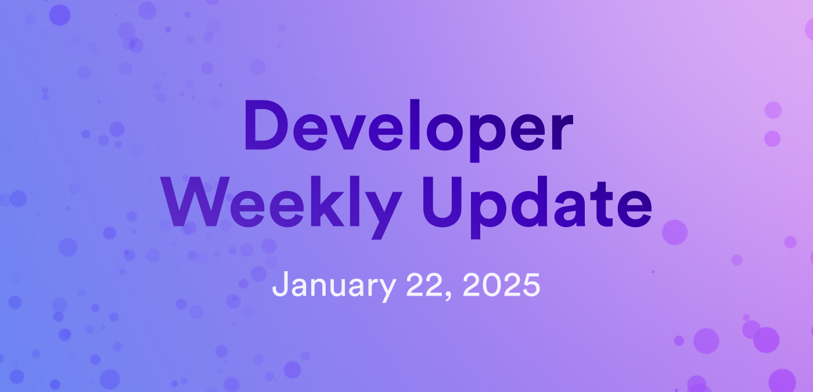

# Developer weekly update January 22, 2025

Hello developers, and welcome to this week's developer weekly update! This week, we have a new release of Motoko, a forum discussion regarding some changes to `dfx`, and an NNS proposal that adds 17 new API boundary nodes to the network. Let's get started!

## Motoko v0.13.6

A new version of Motoko has been released! This release includes an important breaking change regarding orthogonal persistence:

- The Wasm persistence modes used internally for canister upgrades now use lowercase names `keep` and `replace` rather than `Keep` and `Replace`. If you are using actor classes with orthogonal persistence, you will need to recompile your code and upgrade it to use the latest `moc` and `dfx`.

This release also includes support for low Wasm memory hooks `system func lowmemory() : async* () { ... } ` and a few bug fixes:

- Mitigations and checks regarding timers.

- Valid upgrades that delete a stable variable previously failed the `--enhanced-orthogonal-persistence` stable compatibility check.

[Read the full release notes](https://github.com/dfinity/motoko/releases/tag/0.13.6).

## Proposed `dfx` changes

A new change has been proposed on the forum for `dfx`: Remove the local replica with PocketIC. PocketIC is a canister testing tool that provides extensive, customizable testing capabilities in the local environment. `dfx` currently uses PocketIC in parallel with the local replica for CI testing without any substantial differences.

Replacing the replica with PocketIC will make `dfx` smaller to download, plus speed up local deployment times.

The SDK team has proposed a plan to remove the replica from `dfx` and replace it with PocketIC. You can read more about this plan on the [developer forum](https://forum.dfinity.org/t/dfx-replacing-the-local-replica-with-pocketic/40167) and contribute to the discussion.

## New API boundary nodes

NNS proposal [134902](https://dashboard.internetcomputer.org/proposal/134902) has been executed, adding 17 new API boundary nodes to the ICP network. Each node was already part of the network but was previously unused before being converted into a boundary node. Nodes were chosen based on geographic location to ensure distribution across different regions.

This is a significant change and an important architecture milestone, as the network previously only had 3 API boundary nodes. With a total of 20 API boundary nodes in various regions across the globe, ICP will now feature a fully NNS-managed edge architecture, enabling clients such as `agent-rs` to connect directly to the network without relying on the traditional boundary node infrastructure.

You can learn more about this network change on [the forum](https://forum.dfinity.org/t/proposal-134902-adding-17-api-boundary-nodes/40199).

That'll wrap up this week. Tune back in next week for more developer updates!

-DFINITY