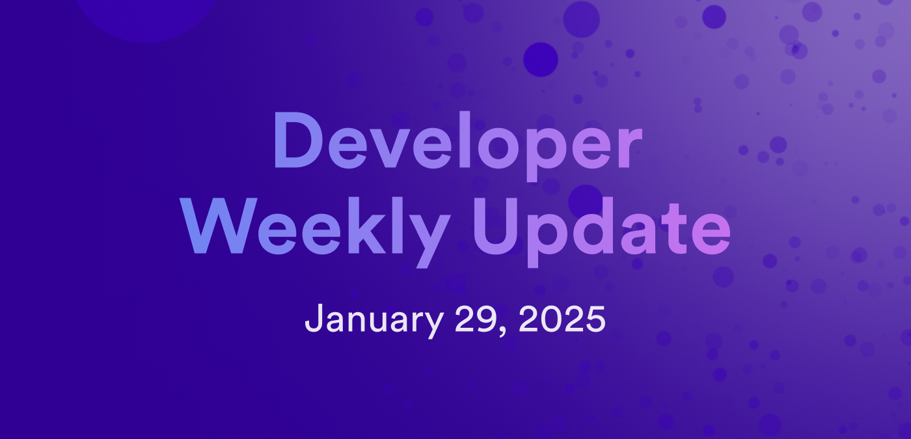

---

title: Developer weekly update January 29, 2025

description: This week, there are some important updates regarding upgrading ledger canisters, the Inter-canister Event Utility working group, and a new agent for Elixir development.

tags: [Devs]

image: /img/blog/dev-update-blog-jan-29.jpg

---

# Developer weekly update January 29, 2025

Hello developers, and welcome to this week's developer weekly update! This week, there are some important updates regarding upgrading ledger canisters, the Inter-canister Event Utility working group, and a new agent for Elixir development. Let's get started!

## Ledger suite upgrade

The DFINITY team has migrated the ICRC ledger suite to use stable storage for key data structures. In the past, ledgers could downgrade to the immediately previous version seamlessly. Using stable storage introduces a breaking change that makes the previous downgrade workflow no longer possible. Also, these updates implement several critical changes, meaning in order to upgrade to the latest ICRC ledger suite, you must follow a specific series of upgrade steps.

These upgrades should be applied to the ledger suite canisters Index, Ledger, and Archive in that order.

To learn more and view the important upgrade instructions, please read [the ledger suite upgrade forum post](https://forum.dfinity.org/t/icrc-ledger-suite-upgrade/40655).

## Inter-canister Event Utility working group

The Inter-canister Event Utility working group has resumed weekly meetings! This group is dedicated to discussing and developing event system architectures and workflows for ICP. One such common architecture is the PubSub structure, where one canister publishes data that another canister can subscribe to. This can be useful for canisters that want to get notifications about certain data from another canister or source, such as the ICP ledger publishing transaction info that a user can subscribe to.

The group meets every week on Wednesday at 7:00 pm CET. [Learn more](https://forum.dfinity.org/t/technical-working-group-inter-canister-event-utility-working-group/29048).

## ICP agent: Elixir

A new ICP agent has been developed by the ICP community: the ICP agent for Elixir! Elixir is a general-purpose programming language that has grown in popularity for blockchain projects, instant messaging apps, video conferencing apps, and financial systems.

The ICP agent Elixir supports update and query calls on ICP. It authenticates calls using Secp256k1 keys.

You can learn more in the project's [GitHub repo](https://github.com/diodechain/icp_agent).

That'll wrap up this week. Tune back in next week for more developer updates!

-DFINITY