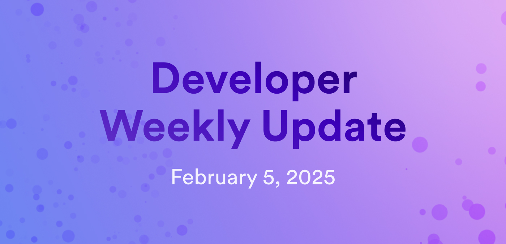

---

title: Developer weekly update February 5, 2025

description: This week, there is a pre-release of Motoko v0.14.0, a new beta release of dfx, and proposals for SNS updates.

tags: [Devs]

image: /img/blog/dev-update-blog-feb-5.jpg

---

# Developer weekly update February 5, 2025

Hello developers, and welcome to this week's developer weekly update! This week, there is a pre-release of Motoko `v0.14.0`, a new beta release of `dfx`, and new proposals for SNS updates. Let's get started!

## Motoko v0.14.0

A new Motoko version has been pre-released and is available for testing on the [Motoko playground](https://play.motoko.org/)!

This new version includes:

- Add `.values()` as an alias to `.vals()` for Arrays and Blobs.
- Support explicit, safe migration of persistent data allowing arbitrary transformations on a selected subset of stable variables.
- Additional static checks warn against possible data loss.

[View the forum post](https://forum.dfinity.org/t/pre-release-moc-0-14-0-available-in-playground/40857) and [full release notes](https://github.com/dfinity/motoko/releases) for more details.

## dfx v0.25.0-beta.1

A new release of `dfx` is ready for beta testing! This release is jam-packed with new features and bug fixes. A small sample of new features includes:

- Streamlined output for asset synchronization.
- `dfx info pocketic-config-port`.
- Streamlined output for `dfx new`.
- Impersonating sender of requests to a local PocketIC instance.
- `dfx canister [create|update-settings] --wasm-memory-threshold`.
- `dfx start --pocketic` supports `--force` and shared networks.
- Error when using insecure identity on the mainnet.

Some of the bug fixes include:

- `dfx canister install` and `dfx deploy with --no-asset-upgrade` no longer hang indefinitely when Wasm is not up to date.
- Correctly detects hyphenated Rust bin crates.
- `dfx` downloads `.did` files for remote canisters.
- Template frontends now have unsupported browser warnings, specifically for default security headers that cause Safari to break when viewing local canisters.
- `dfx deploy --by-proposal` no longer sends chunk data in `ProposeCommitBatch`.
- All commands with `--all` parameter skip remote canisters.

[Read the full release notes](https://github.com/dfinity/sdk/releases/tag/0.25.0-beta.1).

## Proposals for SNS changes

Two new proposals have been submitted for SNS updates. These proposals are [135067](https://dashboard.internetcomputer.org/proposal/135067) and [135066](https://dashboard.internetcomputer.org/proposal/135066). These proposals include:

- Enable SNSes to opt in for [automatically advancing its target version](https://forum.dfinity.org/t/proposal-opt-in-mechanism-for-automatic-sns-target-version-advancement/39874)
to the newest version blessed by the NNS.

- Do not redact chunked Wasm data in `ProposalInfo`.

- The `LogVisibility` returned from `canister_status` has one more variant `allowed_viewers`, consistent with the corresponding management canister API.

[Learn more on the forum](https://forum.dfinity.org/t/sns-updates-2025-02-01/40743).

That'll wrap up this week. Tune back in next week for more developer updates!

-DFINITY
