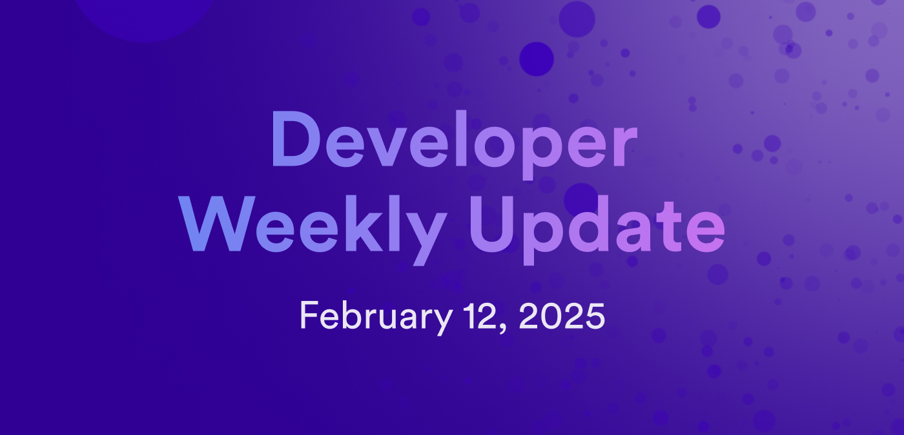

# Developer weekly update February 12, 2025

Hello developers, and welcome to this week's developer weekly update! This week we have exciting community updates to highlight, including IC-Solana, ICP C++ bootcamp, and CycleOps canister fleets. Let's get started!

## IC-Solana

IC-Solana is a new community project that provides a solution for connecting ICP dapps to Solana. IC-Solana uses an RPC canister similar to the EVM RPC canister used to interact with Ethereum and EVM networks. RPC canisters use HTTPS outcalls to send JSON RPC requests to RPC providers. IC-Solana can be used to retrieve Solana-specific data like block details and account information. It can also be used to sign and submit transactions directly to Solana using threshold signatures. Other key features of the project include integrated metrics, enhanced logging, and quorum-based validation that aggregates and validates responses from different RPC providers.

[Learn more about IC-Solana](https://forum.dfinity.org/t/ic-solana-gateway-for-interacting-with-solana-from-the-ic/41104) on the developer forum.

## ICP C++ bootcamp

A new episode of the ICP C++ bootcamp series has been released! ICPP-PRO is a C++ canister development kit (CDK) for building canisters written in C++. To help onboard users and get them started, the ICP C++ bootcamp series is designed to walk through the necessary developer environment setup and tooling.

[You can find the full series on YouTube](https://www.youtube.com/playlist?list=PLzpzHgGOuycIsK0mOiHMXLKq8Gf1VytkJ).

## CycleOps canister fleets

CycleOps has released a new exciting feature: canister fleets! To upload a canister fleet, CycleOps now supports adding hundreds of canisters at once through the new CSV upload capability. Once a fleet of canisters has been uploaded, the CycleOps dashboard will automatically aggregate the metrics for all canisters for easy access to key information like how many total cycles burned and which canisters have a healthy cycles balance.

View the full details about these changes on the [CycleOps changelog](https://docs.cycleops.dev/changelog/canister-fleets).

That'll wrap up this week. Tune back in next week for more developer updates!

-DFINITY
