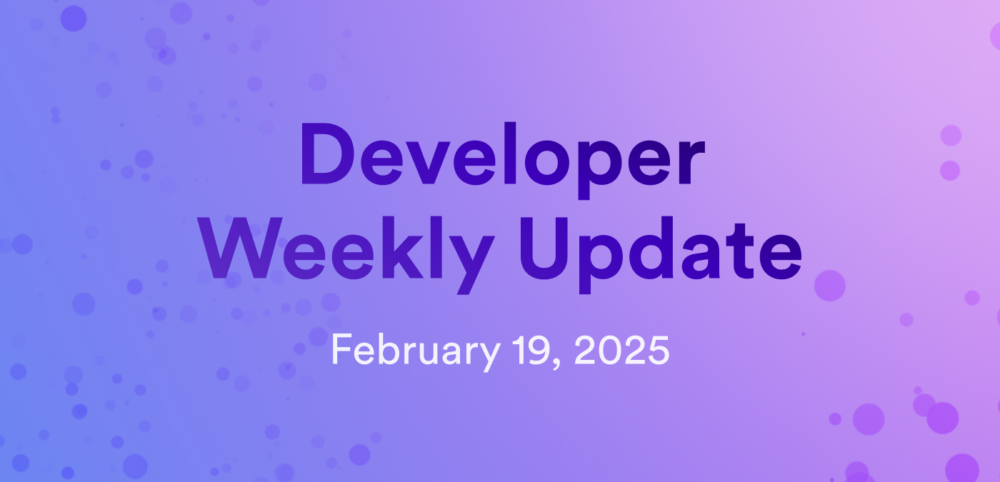

# Developer weekly update February 19, 2025

Hello developers, and welcome to this week's developer weekly update! This week we have new releases of `dfx` and the ICP JavaScript agent, plus some exciting updates to ICP Ninja. Let's get started!

## dfx v0.25.0

A new version of `dfx` has been released! New features in this release include:

- Significant changes regarding `dfx` command output that drastically simplifies the amount of output returned to the developer. Previous, detailed output can still be accessed via the `-v` verbose flag.

- PocketIC implementation of the replica API can now be used in the local development. This will become the default in a future release. PocketIC can be used via the `dfx start --pocketic` command.

- PocketIC now features a new `--impersonate <prinicpal>` workflow for testing calls sent from different principals.

- Canisters now accept the settings flag `--wasm-memory-threshold <threshold>`.

[Read the full release notes](https://github.com/dfinity/sdk/releases/tag/0.25.0).

## ICP JavaScript agent v2.3.0

The latest release of the ICP JavaScript agent has been published. Important updates in this release include:

- FetchRootKey: Newly refactored logic changes how the `fetchrootkey` is awaited before the first async call is made.

- ReadState expiry rollback: Reverts a bug introduced in v2.1.3 regarding a reused `readstate` request with a mismatched `ingress_expiry`.

- SyncTime: HttpAgent will now use an anonymous identity for syncTime calls. This fixes a bug where clocks diverging by greater than 5 minutes could not sync their time with the replica.

- HttpAgent errors: Enhanced error messages with more information for logging and debugging.

[Read the full release notes](https://github.com/dfinity/agent-js/releases/tag/v2.3.0).

## ICP Ninja: February release

ICP Ninja has received a huge upgrade! The web IDE tool introduced several new features, plus a brand new design. New features include:

- Ability to create a new project from a blank template rather than selecting an existing project.

- Ability to reset project files to their default.

- Enhanced AI assistant functionality, including explaining code snippets, fixing code syntax, and improving code syntax.

- Improved example projects.

- New example projects, including EVM Block Explorer.

Be sure check to out [ICP Ninja](https://icp.ninja) to view the cool new branding and website design as well!

That'll wrap up this week. Tune back in next week for more developer updates!

-DFINITY
