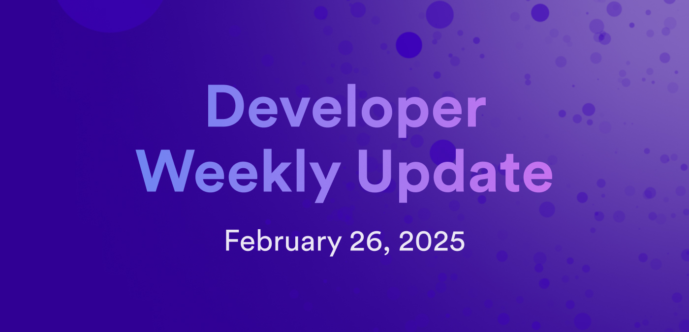

# Developer weekly update February 26, 2025



Hello developers, and welcome to this week's developer weekly update! This week, there is an important update on canister migration, a new proposal for `dfx` telemetry, and an exciting community project to showcase. Let's get started!

## Canister migration

Work on the highly anticipated canister migration feature has begun! Canister migration will enable developers to move a canister from one subnet to another while preserving the canister's ID, state, and cycles balance. Canister migration will not preserve transient state such as canister metrics, logs, history, or reserved cycles.

Canister migration will be split across three phases:

1. Canister state migration: A snapshot of the canister will be taken, downloaded, and then uploaded to the destination subnet. This will also enable developers to download and upload canister snapshots outside of the canister migration workflow.

2. Canister cycles migration: Achieved through a cycles wallet.

3. Canister ID migration: Achieved through a dedicated NNS system canister.

[Read all the details on the forum](https://forum.dfinity.org/t/canister-migration/41585).

## Telemetry for dfx

A new proposal regarding collecting analytics for `dfx` has been introduced on the forum. Telemetry for `dfx` would collect anonymous data about how users are utilizing `dfx` for different workflows and which error messages users experience. With this data, the DFINITY SDK team that develops `dfx` can gain insight into several aspects of the tooling, such as:

- Understanding which versions of `dfx` are being actively used.
- Learning functionality is not being used and could be deprecated.
- Which bug fixes and features should be prioritized.

Data that would be collected includes:

- A randomly generated session ID.
- `dfx` version.
- `dfx` command being executed.
- Parameters passed to the command, but will not include parameter values.
- Exit code.
- Replica reject codes.
- Execution time.
- Indication of whether the cycles ledger or a cycles wallet was used.
- Type of network the project was deployed to.
- Number and type of canisters in the project.
- Type of identity used.

Users would be able to opt out of telemetry data being collected from their environment through a `dfx` environment variable or a global configuration setting.

This proposal is open to community feedback and questions. Join the discussion on the [forum](https://forum.dfinity.org/t/dfx-telemetry-proposal-2025/41569).

## ICE: Task runner for ICP

This week, we're showcasing the community project ICE: a task runner for ICP that is designed to provide a developer tooling workflow that feels similar to the hardhat tooling available in the Ethereum ecosystem. ICE can be installed via npm:

```
npm i -S @ice.ts/runner @ice.ts/canisters
```

You can view sample canister projects on [GitHub](https://github.com/MioQuispe/ICE-example) to test it out with.

The core features of ICE include:

- Type safety throughout.
- NPM install canister: Install common canisters via npm, including the ledger canisters, Internet Identity, and NNS.
- Smart defaults.
- VSCode extension.

[Learn more on the dev forum](https://forum.dfinity.org/t/introducing-ice-a-task-runner-for-the-internet-computer-like-hardhat/41579).

That'll wrap up this week. Tune back in next week for more developer updates!

-DFINITY
