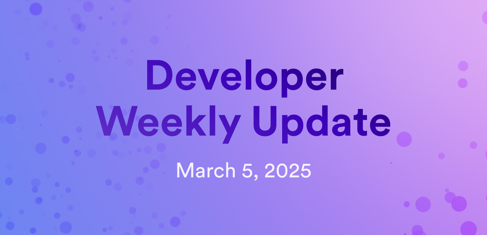

# Developer weekly update March 5, 2025

Hello developers, and welcome to this week's developer weekly update! This week, the new Motoko base library has been released, there is an update from the boundary node team, and there are a few important discussions happening on the forum. Let's get started!

## Motoko's new base library release

The new Motoko base library has been released for testing! The new base library has been published under the Mops package `new-base` and introduces a major overhaul of several Motoko features and syntax. A summary of these changes can be found below:

- New imperative and functional data structures.
- Simplified type conversions.
- Data structures no longer rely on hashing.
- `range()` functions for each numeric type, with an exclusive upper bound.
- `VarArray` module for more conveniently working with mutable arrays.
- `Random` module with a cleaner API and optional pseudo-random number generation.
- Many other changes for consistency, clarity, and convenience.

A full breakdown with important details has been published as a separate blog post: [Try the new Motoko base library: feedback requested!](https://internetcomputer.org/blog/features/new-motoko-base)

## Discussion: Reproducible builds and code verification

An important community discussion is happening on the developer forum. Recently, a [Motoko reproducible build template](https://github.com/research-ag/motoko-build-template) was introduced, intending to standardize how code can be structured to ensure accurate reproduction and verification.

The forum discussion proposes a few ideas of how this template can be expanded upon further and what parameters for standardization could be considered.

Please check out the [forum post and leave your thoughts.](https://forum.dfinity.org/t/lets-discuss-reproducible-builds-and-code-verification-once-again/41918?u=marc0olo)

## Boundary node update

The new decentralized boundary node architecture plans to introduce enhanced observability, as observability is crucial for diagnosing issues and providing developers insight into usage patterns. The network's API boundary nodes handle every incoming request to ICP, making them a good candidate to offer developers valuable data without compromising privacy.

As part of the ICP Levitron roadmap milestone, the API boundary nodes plan to implement a new data hashing workflow that will collect observability data and anonymize it.

You can read more details on the [developer forum](https://forum.dfinity.org/t/observability-with-the-new-boundary-node-architecture/41725).

## Request for feedback: WebSocket support in Azle

The Demergent Labs team is asking for your input on the upcoming Azle 1.0 release. Let the team know if IC WebSocket support is something that you'd like to see in the upcoming Azle release or not:

https://forum.dfinity.org/t/opinion-poll-ic-websocket-support-in-azle/41734

That'll wrap up this week. Tune back in next week for more developer updates!

-DFINITY
