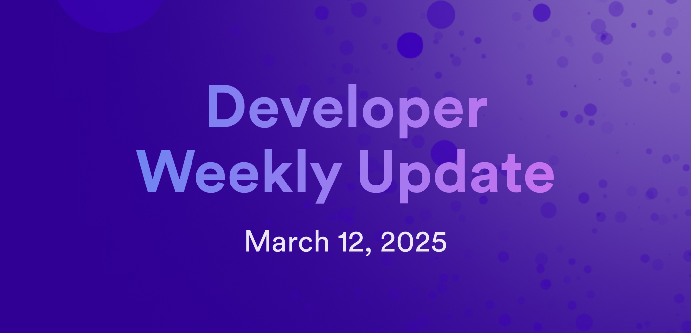

# Developer weekly update March 12, 2025

Hello developers, and welcome to this week's developer weekly update! This week, there is an important ongoing discussion regarding reproducible builds, an API change for neuron dissolve delays, and a discussion regarding standards for deprecated SNSes. Let's get started!

## Community conversation: Reproducible builds and code verification

An important community conversation regarding reproducible builds is happening on the forum. The goal of this discussion is to brainstorm ideas for a reproducible build standard, where developers will be asked to structure their code and canisters in a manner that is easily reproducible and verifiable. This standard would include parameters for builds that use Motoko, Rust, Azle, and possibly other supported CDKs.

Have ideas or questions? [Join the discussion](https://forum.dfinity.org/t/lets-discuss-reproducible-builds-and-code-verification-once-again/41918).

## Dissolve delay API change

An upcoming API change regarding neuron minimum dissolve delay will take effect March 17, 2025. This change may effect clients that use neurons, specifically the constraint on the minimum dissolve delay required for neurons to propose or vote.

If you have an NNS downstream client that executes neuron-related functions, it is recommended that you check if your client relys on the minimum delay constant. If so, start reading its value from the network economics API (`NetworkEconomics.VotingPowerEconomics.neuron_minimum_dissolve_delay_to_vote_seconds`) when it becomes available.

You can learn more on the [developer forum](https://forum.dfinity.org/t/api-change-neuron-minimum-dissolve-delay-constraint-update-release-eta-march-17-2025/42100).

## Defining SNS deprecation standards

The DFINITY Governance team would like to propose a standard that defines criteria for an SNS to be consider deprecated. A deprecated SNS is any SNS that has not had transaction or proposal activity for a specified amount of time.

Such a standard is important, as there is currently no cleanup process for SNSes that are no longer active or maintained. Before the standard can be defined, the team would like to agree upon the following:

- Types of transactions that are still relevant to users.
    - Submitted proposals.
    - SNS ledger transactions.

- A reasonable period of inactivity before an SNS would be considered deprecated:
    - Two months.

Join the [forum discussion](https://forum.dfinity.org/t/defining-deprecated-snss/42105) for more information.

That'll wrap up this week. Tune back in next week for more developer updates!

-DFINITY

