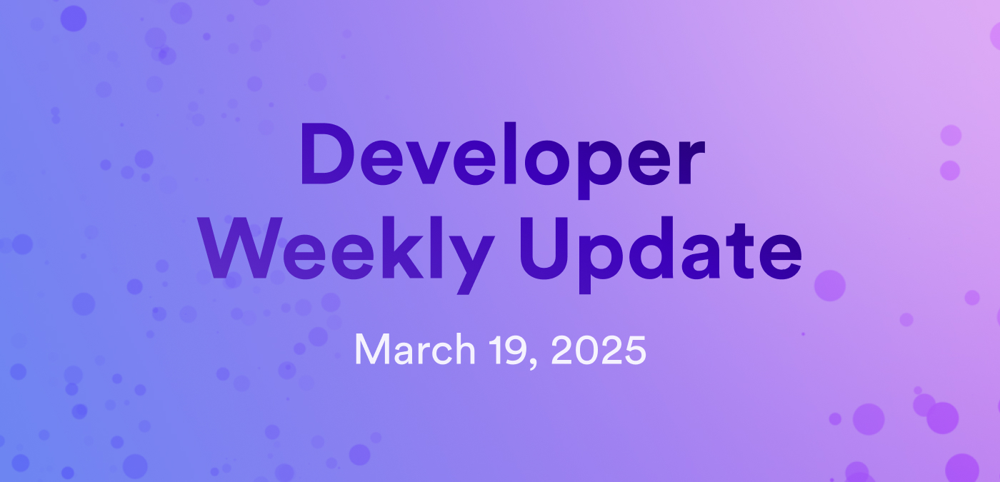

# Developer weekly update March 19, 2025

Hello developers, and welcome to this week's developer weekly update! This week, there are eight newly proposed ICRC standards created by ICDevs.org, new block types to capture specific ledger events, and the Coulomb milestone achievement. Let's get started!

## Newly proposed ICRC standards

ICDevs have designed and proposed eight new ICRC standards that would focus on transparency, traceability, auditability, and provenance of canister Wasm files. Collectively, these standards would provide developers with the ability to:

- Create a canister app type.
- Upload new versions of that app.
- Have others verify the app's build.
- Deploy and orchestrate the canister.
- Upgrade or roll back the canister.
- Track upgrades or reinstallations in an itemized log.
- Create a fully auditable canister where every interaction is stored within a transaction log.

The eight proposed standards are:

- [ICRC-105](https://forum.dfinity.org/t/icrc-105-enhancing-canister-installation-configuration-transparency/42588/1): Installation and configuration history block definitions.

- [ICRC-118](https://forum.dfinity.org/t/icrc-118-wasm-registry-definition-for-version-control-and-history/42589/1): Wasm registry definition for version control and history.

- [ICRC-119](https://forum.dfinity.org/t/icrc-119-wasm-registry-block-specification/42590/1): Wasm registry block specification.

- [ICRC-120](https://forum.dfinity.org/t/icrc-120-canister-wasm-orchestration-service/42591/1): Canister Wasm orchestration service specification.

- [ICRC-121](https://forum.dfinity.org/t/icrc-121-wasm-orchestration-service-block-specification/42593/1): Wasm orchestration service block specification.

- [ICRC-126](https://forum.dfinity.org/t/icrc-126-wasm-verification/42592/1): Wasm verification.

- [ICRC-127](https://forum.dfinity.org/t/icrc-127-generic-bounty-system/42594/1): Generic bounty system for verification.

- [ICRC-133](https://forum.dfinity.org/t/icrc-133-generic-input-capture-and-state-change-extends-icrc3/42595/1): Generic input capture and state change (extends ICRC-3).

You can learn more on the [developer forum](https://forum.dfinity.org/t/icrc-105-and-its-seven-cousins/42596).

## New blocks for ledgers

Token ledger standards are undergoing improvements to support the development of Real-World Asset (RWA) ledgers and the essential features for tokenized asset management. One of these improvements is the upcoming introduction of new block types that will be used to capture specific ledger events beyond standard transactions. These include:

- Fee collection.
- Authorized mint and burn blocks.
- Governance or compliance blocks.

This change matters to developers who implement application logic that parses ledger blocks for transaction analysis, indexing, or history. The introduction of these new blocks may interfere with your current implementation.

For more information, [read the full details on the forum.](https://forum.dfinity.org/t/upcoming-new-block-types-for-icp-ledgers-important-for-wallets-dashboards-indexers/42567/1)

## Coulomb milestone achievement

The ICP Roadmap milestone Coulomb has been completed! Part of the Developer Experience Roadmap track, the Coulomb milestone focuses on the release of several new features and enhancements to ICP Ninja, a web-based IDE environment for developers to build and deploy ICP applications directly from their web browser.

In this release, ICP Ninja now features:

- A redesigned landing page.
- Sign in with Internet Identity or GitHub.
- Project saving and sharing.
- Export to GitHub.
- New example projects, including an EVM block explorer and an LLM chatbot.

You can read the full [blog post](https://medium.com/dfinity/icp-ninja-update-coulomb-milestone-unleashed-0d980651f707) or leave your thoughts [on the forum](https://forum.dfinity.org/t/icp-ninja-update-coulomb-milestone-unleashed/42561/).

That'll wrap up this week. Tune back in next week for more developer updates!

-DFINITY