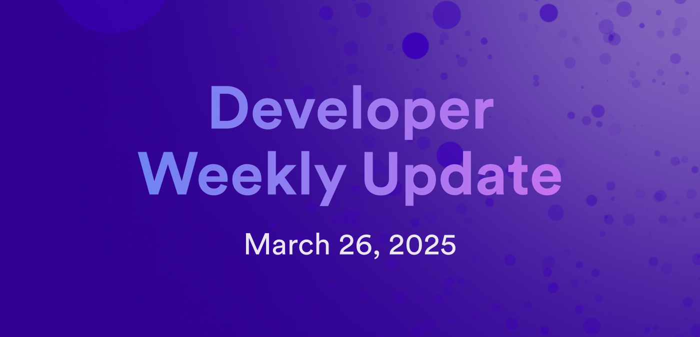

# Developer weekly update March 26, 2025

Hello developers, and welcome to this week's developer weekly update! This week, there is a motion to pause the NNS Neurons' Fund, a new beta release of `dfx`, and a few new updates to Juno. Let's get started!

## Motion to pause NNS Neurons' Fund

A proposal has been submitted to pause the Neurons' Fund to prevent the creation of SNS proposals that request a Neurons' Fund contribution. SNSes will still be able to launch without a Neurons' Fund.

The motivation behind pausing the Neurons' Fund stems from a problem that arises when a dapp owner participates in an SNS swap with their own tokens and makes the project look more valuable than it might be. The community has raised concern regarding the design of the Neurons' Fund matched funding, and as a result, some have begun to distrust the SNS framework and its authenticity.

The Neurons' Fund mechanism will be reconsidered, and discussions will begin regarding how it can be improved in the future.

[Learn more on the forum](https://forum.dfinity.org/t/motion-proposal-to-pause-the-neurons-fund/43014).

## `dfx 0.26.0-beta.1` release

A new version of `dfx` has been released for beta testing. Important new features of `v0.26.0` include:

- `dfx` now uses `--pocketic` by default rather than running a local replica itself.

- `dfx` now reports telemetry data to a DFINITY server by default. This can be disabled or configured to collect only local development data. For more information or to comment, please see https://forum.dfinity.org/t/dfx-telemetry-proposal-2025/41569.

- `dfx ledger allowance` subcommand has been added to comply with the ICRC-2 standard.

- The VetKD test key `Bls12_381_G2:dfx_test_key` can be used when `dfx` is started locally with `dfx start --replica`.

[Read the full release notes](https://github.com/dfinity/sdk/releases/tag/0.26.0-beta.1)

## Latest Juno release

A new version of Juno has been released! This rather large release includes:

- Newly revamped onboarding.

- Updated template dependencies.

- Local dev is now the default for applications.

- Scaffold serverless functions are now available.

[Learn more about Juno](https://forum.dfinity.org/t/latest-juno-releases/36771/23).

That'll wrap up this week. Tune back in next week for more developer updates!

-DFINITY

