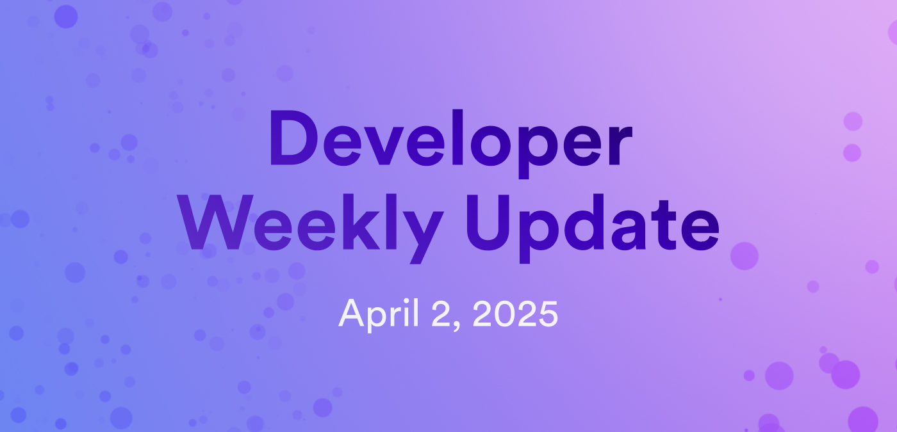

# Developer weekly update April 2, 2025

Hello developers, and welcome to this week's developer weekly update! This week, there is a new Motoko release, an exciting ICP Ninja announcement, and a community fundraising event for Motoko EVM. Let's get started!

## Motoko v0.14.6

A new version of Motoko has been released! Highlights of the latest update include:

- Stable fields are no longer dropped or promoted to lossy supertypes to implicitly prevent data loss. Removing a stable variable or promoting its type to a lossy supertype now requires explicit migration.

- Fields in literal objects and record extensions that are inaccessible due to user-specified type constraints now return a warning.

- Release artifacts for Darwin-arm64 and Linux-aarch64 platforms

[Read the full release notes](https://github.com/dfinity/motoko/releases/tag/0.14.6).

## ICP Ninja update

Have a cool project that you're proud of and want to share? What about a simple boilerplate project that showcases a new ICP feature? ICP Ninja now accepts submissions for example projects that will be showcased on the [ICP Ninja homepage](https://icp.ninja).

It is recommended that you build your example directly within ICP Ninja, such that it starts out with the correct tooling, structure, and configuration. If you do that, your project will naturally be in the correct format and can be easily added.

Read the full instructions for [contributing an example on GitHub.](https://github.com/dfinity/examples/blob/master/NINJA_CONTRIBUTING.md)

## Motoko EVM fundraising

The Motoko EVM project has begun fundraising through Gitcoin Grants and is asking for your support!

The project aims to provide a virtual machine that integrates the functionalities of the Ethereum Virtual Machine into ICP alongside ICP-specific features and capabilities. It strives to provide an environment for L2 and L3 appchains to utilize ICP's security from their initial deployment.

[Read the full project details on the forum](https://forum.dfinity.org/t/gitcoin-grants-23-motoko-evm-fundraising-starts-today/43307).

How you can support:

- Donate to the project via Gitcoin Grants.

- Spread the word on X.

- Leave feedback about the project on the [forum](https://forum.dfinity.org/t/gitcoin-grants-23-motoko-evm-fundraising-starts-today/43307).

That'll wrap up this week. Tune back in next week for more developer updates!

-DFINITY

