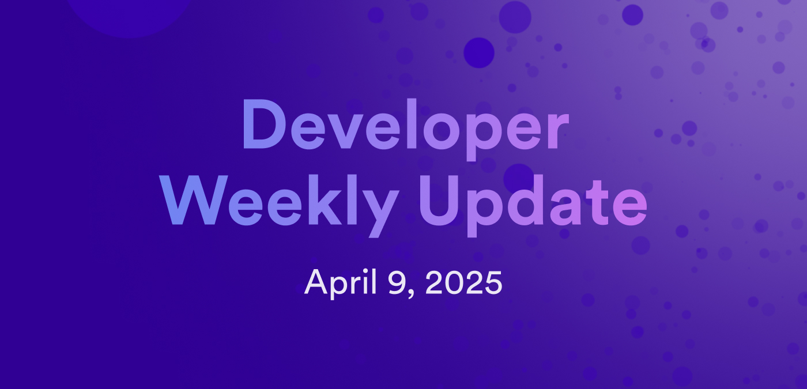

# Developer weekly update April 9, 2025



Hello developers, and welcome to this week's developer weekly update! This week we have an exciting new community tool called `ic-test`, a reminder about SNS custom proposal types, and a new release of ICRC Rosetta. Let's get started!

## `ic-test`

`ic-test` is a new community tool that can automate canister boilerplate generation and setup for creating canister and cross-chain tests. First, it reads your project's `dfx.json` and `foundry.toml` files to learn your project's setup, then it generates Rust types from your canister's Candid files and creates Solidity interfaces from your contract definitions. Under the hood, it uses `pocket-ic` and `foundry` to run tests using a basic API to interact with your canister's Wasm files.

You can install `ic-test` with cargo: `cargo install ic-test`.

Then, use `dfx` to build your project: `dfx build`.

Lastly, create a new test workspace with `ic-test new tests`. This workspace will include bindings for each canister and EVM smart contract within your project.

Here's a quick "Hello, world!" example:

```
dfx new hello --type rust
ic-test new
```

Edit `tests.rs` to include the actual test logic, such as:

```rust
// ...

async fn setup(test: IcpTest) -> Env {
    let icp_user = test.icp.test_user(0);

    let hello_backend = hello_backend::deploy(&icp_user).call().await;

    let hello_frontend = hello_frontend::deploy(
        &icp_user, // init args
        None,
    )
    .call()
    .await;

    // Additional setup steps
    // ...

    Env {
        test,
        hello_backend,
        hello_frontend,
    }
}

#[tokio::test]

async fn test_greet() {
    let Env {
        test,
        hello_backend,
        hello_frontend,
    } = setup(IcpTest::new().await).await;

    // Call the greet method

    let result: String = hello_backend.greet("ic-test".to_owned()).call().await;
    assert_eq!(result, "Hello, ic-test!");
}
```

Run the tests with `cargo test`.

You can learn more about `ic-test` on the [developer forum](https://forum.dfinity.org/t/introducing-ic-test-a-tool-for-testing-cross-chain-ic-projects/43479).

## SNS custom proposal type reminder

Attention devs! This is a reminder that SNSes should categorize existing, custom type proposals to topics.

In the upcoming SNS topics release, SNS proposals with known topics are guaranteed to continue working seamlessly. Proposals submitted without a known topic may be disallowed in the near future until they are assigned to a topic using `SetTopicsForCutsomProposals`.

[Learn more](https://forum.dfinity.org/t/action-required-please-assign-topics-for-your-custom-sns-proposals/42469/2).

## ICRC Rosetta release

A new version of ICRC Rosetta has been released! This latest update, `v1.2.0` adds support for multiple tokens within a single instance. View the [usage guide](/defi/rosetta/icrc_rosetta/#step-3-start-the-integration-software) for detailed instructions on how to use this new feature, or [view the release notes to learn more(https://github.com/dfinity/ic/releases/tag/rosetta-icrc-release-1.2.0).

That'll wrap up this week. Tune back in next week for more developer updates!

-DFINITY


