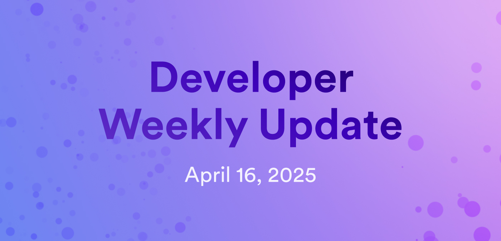

# Developer weekly update April 16, 2025

Hello developers, and welcome to this week's developer weekly update! This week, we have an exciting update on enhanced orthogonal persistence, a new Pic-js release, and two new NNS dapp features. Let's get started!

## Enhanced orthogonal persistence: Blessed for production!

Enhanced orthogonal persistence has been blessed for production with Motoko compiler version 0.14.4 and newer.

Previous versions of Motoko introduced some components of orthogonal persistence, including persistent actors and stable variables, but the introduction of enhanced orthogonal persistence introduces significant safety and scalability enhancements to Motoko.

EOP was designed to provide developers with a simple, safe, and scalable way to deal with stable memory and canister upgrades. With EOP, transitively reachable data structures of any first-order type are automatically persisted across upgrades without needing to configure stable memory or use stable data structures. The ICP runtime system routinely checks type compatibility for canister upgrades and supports data changes through implicit migration. Lastly, upgrades have become significantly faster because the main memory is simply retained on an upgrade. No copying to and from stable memory is needed.

You can learn more about EOP on the [developer forum](https://forum.dfinity.org/t/officializing-enhanced-orthogonal-persistence-eop/43675).

## Pic-js release v0.12.0

Pic-js has two important updates: A new release (v0.12.0) and it has moved to a [new GitHub repo](https://github.com/dfinity/pic-js) under the DFINITY organization.

The new release includes:

- Support for the `set_certified_time` endpoint.

- `Support for the `get_controllers` endpoint.

- The following methods are now async:

    - getTopology()
    - getBitcoinSubnet()
    - getFiduciarySubnet()
    - getInternetIdentitySubnet()
    - getNnsSubnet()
    - getSnsSubnet()
    - getApplicationSubnets()
    - getSystemSubnets()
    - getControllers()

Along with the new repo, there is also a new NPM package and new documentation:

Old NPM: [@hadronous/pic](https://www.npmjs.com/package/@hadronous/pic)
New NPM: [@dfinity/pic](https://www.npmjs.com/package/@dfinity/pic)

Old docs: [hadronous.github.io](https://hadronous.github.io/pic-js/)
New docs: [dfinity.github.io](https://dfinity.github.io/pic-js/)

It is recommended that all users migrate to the new package and repo to get the latest updates and support.

Read more on the [developer forum](https://forum.dfinity.org/t/pic-js-has-moved-to-the-dfinity-github-organization/43792).

## New NNS dapp features

Easter has come early for the NNS dapp with two new exciting features.

First, a new card on the Portfolio page that displays ongoing proposals for launching new SNSes.

The second feature is an easter egg for desktop users. Play with your keyboard to try and find the hidden new feature, and check back in on the [developer forum](https://forum.dfinity.org/t/proposal-136220-to-upgrade-the-nns-dapp-11-04-2025/43683) after the holiday to see the reveal of the feature.

That'll wrap up this week. Tune back in next week for more developer updates!

-DFINITY
