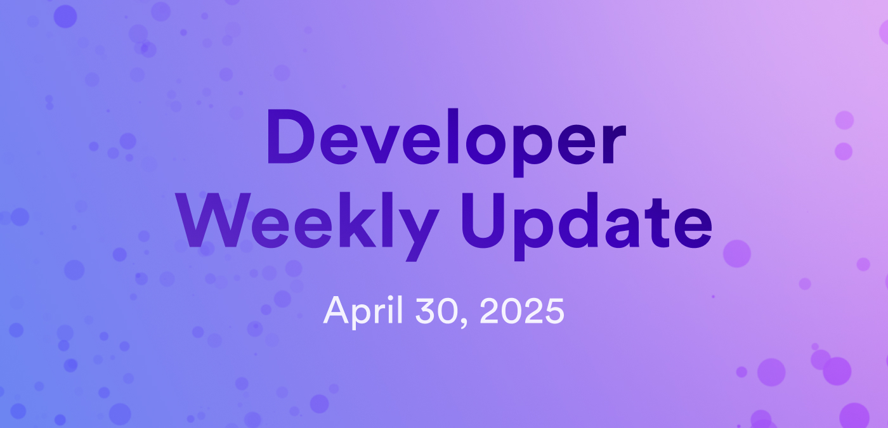

# Developer weekly update April 30, 2025

Hello developers, and welcome to this week's developer weekly update! This week, there are new releases of Motoko, Python pocket-ic, and the ICP dashboard, plus an exciting pre-release of the SOL RPC canister. Let's get started!

## Motoko v0.14.9

A new release of Motoko is available! v0.14.9 introduces new primitives for exploding fixed-width numbers to bytes:

- `explodeNat16`

- `explodeInt16`

- `explodeNat32`

- `explodeInt32`

- `explodeNat64`

- `explodeInt64`

[Read more in the release notes](https://github.com/dfinity/motoko/releases/tag/0.14.9).

## Python pocket-ic v3.1

A new version of Python pocket-ic has been released! This release adds support for PocketIC server v9.0 plus the ability to store and load state to and from a local directory on your computer.

[Try it out yourself or update your project to use the latest version](https://pypi.org/project/pocket-ic/3.1.0/).

## Dashboard v6.0

The ICP Dashboard has gotten a *major* redesign! With updates to almost all dashboard pages, widgets, and components, the dashboard now includes exciting features like:

- A new Networks page that shows the decentralization of the network through an interactive globe that can be used to select data centers and view details.

- If you select a node or subnet, a Nakamoto coefficient score is displayed for each, describing how decentralized each component is.

- A new Tokens page that shows information about all ICP, SNS, and chain-key tokens.

The blog post [Making ICP data more accessible](https://medium.com/dfinity/internet-computer-dashboard-making-icp-data-more-accessible-07784d15108d) goes into detail about each change with screenshots. Definitely give it a read!

## SOL RPC canister v0.1 pre-release

Attention SOL devs! The SOL RPC canister has been pre-released and is ready for you to test and play with! During this pre-release, the canister is deployed as a staging canister (titvo-eiaaa-aaaar-qaogq-cai) controlled by the DFINITY team. Upon official release, a production canister will be controlled by the NNS.

Supported methods for this RPC canister include:

- `getAccountInfo`

- `getBalance`

- `getBlock`

- `getSlot`

- `getTransaction`

- `sendTransaction`

- `jsonRequest`

Want to learn more? [Check out the announcement on the developer forum](https://forum.dfinity.org/t/sol-rpc-canister/41896/2?u=gregory-demay).

That'll wrap up this week. Tune back in next week for more developer updates!

-DFINITY
