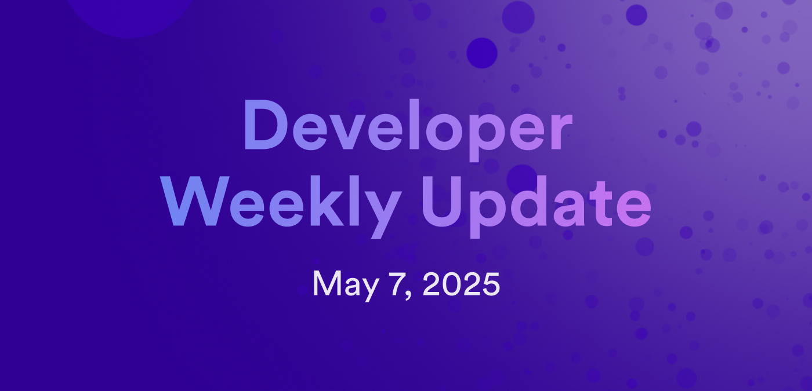

# Developer weekly update May 7, 2025

Hello developers, and welcome to this week's developer weekly update! This week, there are new releases of the ICP and ICRC Rosetta containers and information about this year's World Computer Summit. Let's get started!

## ICP Rosetta v2.1.4

A new version of the ICP Rosetta container is available! Notable updates in this release include:

- Improvements to the container's reliability.

- Watchdog threats now guarantee synchronization threads are not stuck.

- Improved metrics.

- Tip validation delay handling has been enhanced.

[Read more on the developer forum](https://forum.dfinity.org/t/rosetta-icp-and-icrc1-updates/46512).

## ICRC Rosetta v1.2.1

- Connects with multiple ledgers in a single instance.

- Exports per-token metrics in `/metrics`.

- A new algorithm is used to check for gaps.

- Watchdog threats now guarantee synchronization threads are not stuck.

[Read more on the developer forum](https://forum.dfinity.org/t/rosetta-icp-and-icrc1-updates/46512).

## World Computer Summit 2025

The annual World Computer Summit will take place in Zurich on June 3rd, 2025! This will be the 4th annual summit and will feature several exciting discussions and presentations. You can register on the [World Summit event page](https://lu.ma/wcs25).

That'll wrap up this week. Tune back in next week for more developer updates!

-DFINITY

