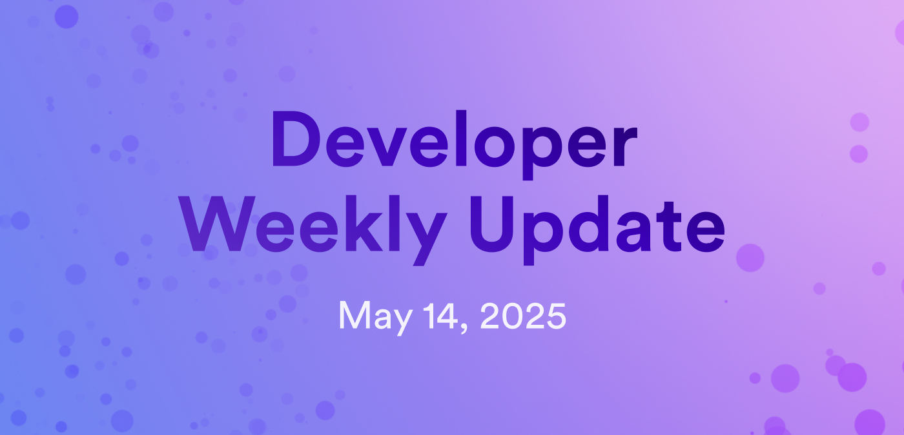

# Developer weekly update May 14, 2025

Hello developers, and welcome to this week's developer weekly update! This week, there are new releases of PocketIC, `dfx`, and June, and the launch of vetKeys on the mainnet for testing. Let's get started!

## PocketIC v9.0.1

A new release of PocketIC is available! This version focuses on a new feature that supports reusing PocketIC state in tests. Additional changes include:

- New type for time that ensures nanosecond precision.

- VetKD support.

- The Rust library has been upgraded to use the `ic-management-canister-types` crate `v0.3.0`.

[View the changelog for the full release notes](https://github.com/dfinity/ic/blob/f195ba756bc3bf170a2888699e5e74101fdac6ba/rs/pocket_ic_server/CHANGELOG.md#901---2025-04-30).

## `dfx` v0.26.1

The latest version of `dfx` (`v0.26.1`) is now promoted! This release includes bug fixes and the latest Motoko compiler `v0.14.8`.

The next release of `dfx` will remove the local replica in favor of PocketIC.

[Read the full release notes](https://github.com/dfinity/sdk/releases/tag/0.26.1).

## Juno v0.0.49

A new release of Juno introduces new updates to the Console UI, including the addition of a new subsection of 'Monitoring' called 'Health Check' and a clearer breakdown of memory metrics.

The description of "auto-refill threshold" has been improved, and the hosting wizard's "authorization domain" step has been simplified.

[Read more on the developer forum](https://forum.dfinity.org/t/latest-juno-releases/36771/28).

## vetKeys launch on the mainnet for testing! 

The vetKeys feature has been launched on the mainnet for testing purposes!

To launch the feature, a test vetKD master key was created when [proposal 136589](https://dashboard.internetcomputer.org/proposal/136589) was accepted. This key is stored on the 13-node application subnet `2fq7c`.

vetKeys functionality on the mainnet enables extensive testing of vetKeys on the mainnet, including operational procedures like key backup and recovery.

It is important to note that at this time, the vetKey feature is strictly intended for testing purposes, as it is still undergoing internal audits and security reviews. It should not be used in production, and it is strongly recommended to limit its use to non-critical testing scenarios only.

[Learn more on the developer forum](https://forum.dfinity.org/t/threshold-key-derivation-privacy-on-the-ic/16560/206?u=marc0olo).

That'll wrap up this week. Tune back in next week for more developer updates!

-DFINITY

