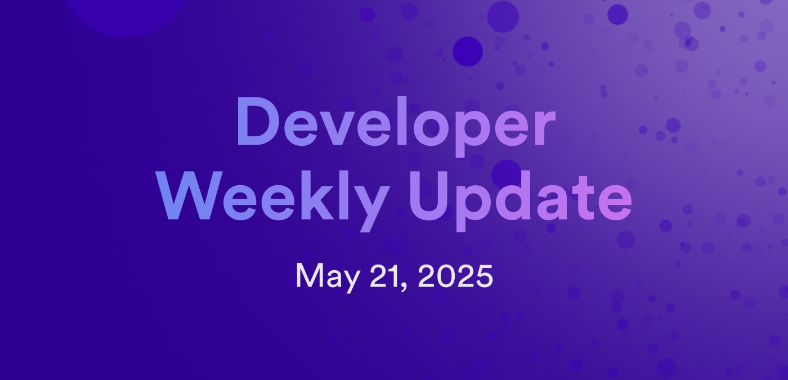

# Developer weekly update May 21, 2025

Hello developers, and welcome to this week's developer weekly update! This week, there is a new release of Motoko, a new release of the ICP dashboard, AMD SEV virtual machine support, and a community survey about Bitcoin testnet usage. Let's get started!

## Motoko  `v0.14.11`

A new release of Motoko is available! In this version, there are:

- Enhancements to syntax error messages with examples.

- Functionality for fields in the language server.

- A bug fix where `mo-doc` now correctly extracts record-patterned function arguments.

[Read more in the release notes.](https://github.com/dfinity/motoko/releases/tag/0.14.11)

## Dashboard release `v6.0.3`

A new version of the ICP dashboard has been released. New features include:

- Improved navigation bar.

- Upgraded NextJS

- Row-level clicking for the ICP transaction table.

- Token page URL updates.

- Cycle burn rate has been added to the home page.

[Check out the ICP dashboard to view these changes.](https://dashboard.internetcomputer.org/)

## AMD SEV virtual machine support

AMD SEV virtual machine support is coming soon! SEV can be used to create encryption keys that protect a node’s state. These keys are connected to the hash of the running replica code and cannot be taken out of the replica’s virtual machine. That means that when there’s a new release with a different hash, it won’t be able to read the state from the previous release.

To support SEV, the replica upgrade workflow must be redesigned to allow securely sharing encryption keys between community-approved releases. The release process also needs to be extended to support computing SEV hashes for each release, meaning the NNS registry will need to be modified to store that additional information.

[Learn more on the developer forum](https://forum.dfinity.org/t/amd-sev-virtual-machine-support/6156/65?u=marc0olo).

## Bitcoin usage survey

Attention, devs! We're asking for your feedback regarding how you utilize Bitcoin testnets during your ICP development. Please fill out the following survey to help us evaluate the testnet options that are available to developers:

http://bit.ly/3GYpfRp

That'll wrap up this week. Tune back in next week for more developer updates!

-DFINITY

