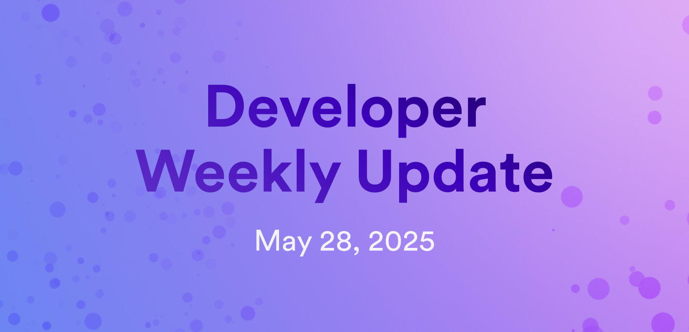

# Developer weekly update May 28, 2025

Hello developers, and welcome to this week's developer weekly update! This week, there are new documentation pages on the vetKeys feature, an update on the Solana RPC canister, and a request for feedback from the community. Let's get started!

## vetKeys documentation

Documentation for the new vetKeys feature has been published! Dive into the new feature and learn about different use cases through these new pages:

- [What are vetKeys?](/docs/building-apps/network-features/vetkeys/introduction) Learn about what vetKeys are, their benefits and use cases, and examples of applications that utilize them.

- [vetKD API](/docs/building-apps/network-features/vetkeys/api): Reference documentation for the vetKeys API endpoints.

- [Distributed key management service](/docs/building-apps/network-features/vetkeys/dkms): Learn about the ready-to-use KeyManager solution that offers access control and vetKey derivation.

- [Encrypted onchain storage](/docs/building-apps/network-features/vetkeys/encrypted-onchain-storage): Learn about the ready-to-use EncryptedMaps solution for encrypted onchain storage.

## SOL RPC canister

The Solana RPC canister is ready for testing on the mainnet! At a very high level, the SOL RPC canister offers the same services to canisters as if a Solana RPC node were directly available on the ICP mainnet.

Check out the [SOL RPC canister README](https://github.com/dfinity/sol-rpc-canister/blob/main/README.md) for detailed usage instructions, including how to query data and how to sign and submit SOL transactions.

## Request for feedback: ICRC-103 (query allowances) on the ICP ledger

Attention developers! We're asking for your feedback regarding ICRC-103 (query allowances) on the ICP ledger. 

Do you a practical, minimal path that solves immediate concerns while preserving privacy and stability, or do you think it’s worth pushing toward ICRC-103 compliance, even with the limitations and transitional pain?

Read all the details and give your input on the [developer forum](https://forum.dfinity.org/t/standard-for-managing-icrc-2-approvals-a-challenge-for-the-icp-ledger/32997/13?u=marc0olo).

That'll wrap up this week. Tune back in next week for more developer updates!

-DFINITY

