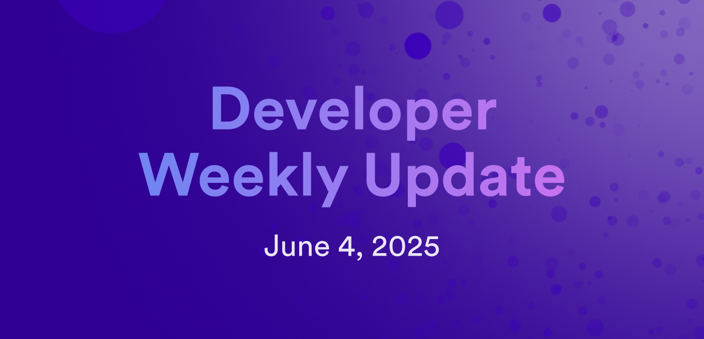

# Developer weekly update June 4, 2025

Hello developers, and welcome to this week's developer weekly update! This week, there is a new `ic-cdk` release, a new feature from the CycleOps platform, and a recap of the World Computer Summit 2025. Let's get started!

## ic-cdk v0.18.3

A new release of the `ic-cdk` has been released. Version 0.18.3 introduces support for the `root_key` API and updates the Bitcoin regtest settings to mirror those used on the mainnet. There are also a few updates to address corner case issues from the `0.18.2` release.

Read the full release notes on the [developer forum](https://forum.dfinity.org/t/ic-cdk-0-18-3-released/49637) and read the [migration guide](https://github.com/dfinity/cdk-rs/blob/0.18.3/ic-cdk/V18_GUIDE.md) if you are updating from `0.17` or older.

## New CycleOps feature

A new CycleOps feature has been released! Creating new canisters has never been easier. Now, forget about cycle wallets or `dfx canister create` commands. Through the [CycleOps](https://cycleops.dev) dashboard, use a few clicks to select a subnet and create a new canister. All canisters created with this workflow automatically come configured with cycle monitoring, email metric reports, and canister management.

[Learn more on the developer forum](https://forum.dfinity.org/t/create-canisters-easier-than-ever/49642).

## World Computer Summit & Caffeine demo

The World Computer Summit 2025 took place on June 3rd and celebrated ICP's 4th birthday. The day was filled with exciting panels, ecosystem demos, and meaningful networking opportunities.

To close out the event, Dominic Williams presented a demo of Caffeine, a long-awaited AI project for creating and deploying canister smart contracts. The demo was live-streamed on X, which you can watch [here](https://x.com/caffeineai/status/1930228469004210221).

That'll wrap up this week. Tune back in next week for more developer updates!

-DFINITY