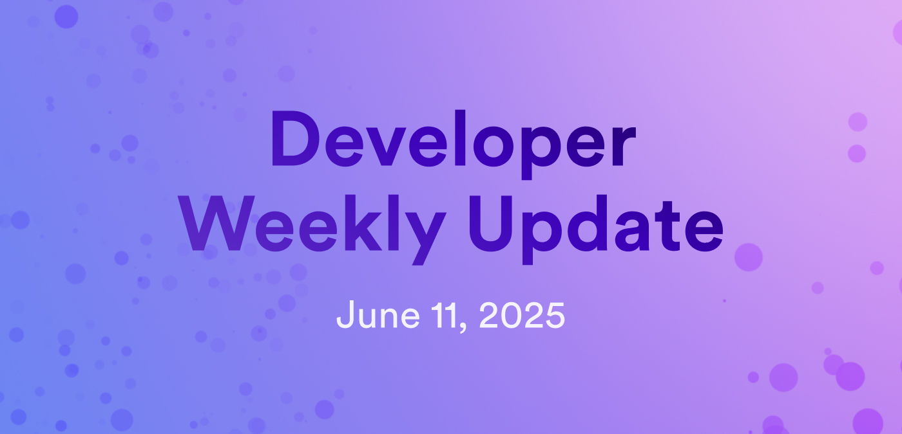

# Developer weekly update June 11, 2025

Hello developers, and welcome to this week's developer weekly update! This week, there is a new release of Motoko, the production key release for vetKeys, and proposed new management canister endpoints to support sleeping in update calls. Let's get started!

## Motoko v0.14.12

A new version of Motoko has been released! The new version, `v0.14.12`, includes:

- Optimizations for `--enhanced-orthogonal-persistence`.

- Bug fixes for `-fshared-code` and stack overflow prevention for large EOP canisters.

- `rootKey` primitive has been added.

[Read the full release notes](https://github.com/dfinity/motoko/releases/tag/0.14.12).

## vetKeys production key release

vetKeys has been in testing for the past several weeks on the `2fq7c` and `fuqsr` subnets. Testing has been successful and workflows such as end-to-end key derivation have been validated.

Therefore, it is now proposed to generate a production key to be used with vetKeys. The production key will be held on subnet `pzp6e`, the same subnet that holds the production ECDSA and Schnorr keys.

As part of the proposal, the production key must be backed up to another subnet. During this backup, the subnet must be temporarily paused. The subnet that will be paused, `uzr34`, also hosts the Internet Identity canister, meaning Internet Identity will be unavailable for approximately 5-10 minutes.

[Learn more about the proposed production key and important notes about the scheduled downtime](https://forum.dfinity.org/t/vetkeys-production-key-and-ii-subnet-downtime/50370).

## Proposal for new management canister endpoints

To support sleeping during update calls, two new management canister endpoints have been proposed. These endpoints would be:

- `observe`: Introduces an `await` condition. This endpoint would only be called by a controller of a given canister or the canister itself. It would only be called through bounded-wait calls.

- `notify`: Used to notify callers of the `observe` endpoint of the number of pending calls with a matching canister ID and event ID. This endpoint would only be called by a controller of a given canister or the canister itself. 

[Read more about the proposal and view examples of how they may be implemented](https://forum.dfinity.org/t/sleeping-in-update-calls/50345).

That'll wrap up this week. Tune back in next week for more developer updates!

-DFINITY
