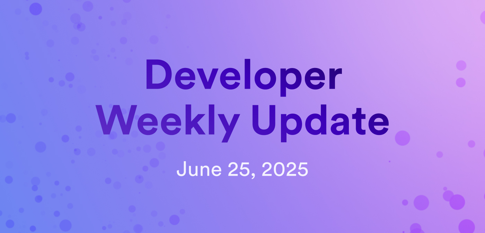

# Developer weekly update June 25, 2025

Hello developers, and welcome to this week's developer weekly update! This week, there's an exciting proposal to launch 30 new subnets on the network, an upcoming event for Caffeine's Alpha launch, and a beta release candidate for Azle v0.32.0. Let's get started!

## Proposal: 30 new subnets

In preparation for the upcoming Caffeine AI release, DFINITY is proposing an expansion of the network that will increase the number of application subnets from 30 to 60, ensuring ICP can support both current traffic and future growth.

The rollout would take place gradually over the coming weeks, with an initial analysis that indicates the network has enough spare capacity to support the additional subnets.

[Learn more on the developer forum](https://forum.dfinity.org/t/adjusting-target-topology-for-caffeine-scaling-60-application-subnets-and-a-us-subnet/51540).

## Hello, self-writing internet event

On July 15th, 2025, join a full-day event in San Francisco (or livestreamed globally) dedicated to exploring the "self-writing internet" with Caffeine, the first tech stack built entirely for AI-driven, conversation-based development. Spanning three interactive floors, the event welcomes AI enthusiasts, developers, and visionaries to experience:

- Keynotes, demos, and panels on the Main Stage

- Hands-on coding and collaboration during the Caffeine Hackathon

- Relaxed networking over specialty drinks and immersive visuals.

[Register for the event](https://lu.ma/hello-swi) to make sure you don't miss it!

## Azle v0.32.0 release candidate

Azle has officially moved from beta to the release candidate phase with version 0.32.0, marking a major step toward its 1.0 release. This milestone reflects growing confidence from Demergent Labs in Azle's stability, performance, and suitability for general-purpose TypeScript or JavaScript canisters on ICP.

Azle is not yet fully recommended for production use. Upcoming changes will focus on testing, documentation, security reviews, and cleanup, with minimal alterations to the codebase.

[Read more on Twitter](https://x.com/lastmjs/status/1937865438836519246).

That'll wrap up this week. Tune back in next week for more developer updates!

-DFINITY