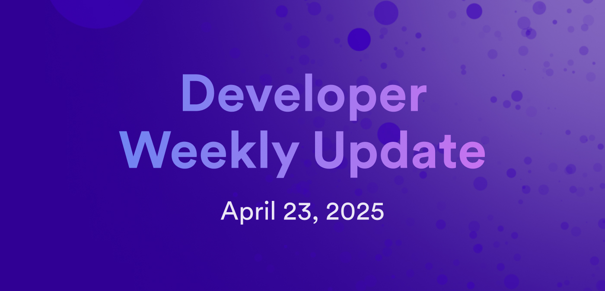

# Developer weekly update April 23, 2025

Hello developers, and welcome to this week's developer weekly update! This week, there is a new release of Motoko, an update to the community project CycleOps, and a reminder about OISY wallet. Let's get started!

## Motoko `v0.14.8`

A new version of Motoko is available in the latest beta release of `dfx` (0.26.1-beta.1).

This release concludes the beta testing of enhanced orthogonal persistence and adds random-access indexing of `Blob`s. This update also includes some parser and type checker improvements implemented by the Serokell team.

Lastly, autogenerated Candid now compiles into more readable JavaScript/TypeScript thanks to fewer type synonyms and preservation of named function arguments.

[Read the full release notes for more information.](https://forum.dfinity.org/t/some-notable-features-in-the-new-moc-0-14-8/44302)

## CycleOps update

The CycleOps team has released an exciting update for topping up your canisters: ICRC deposits! Now, you can fund your canister's automated top-ups directly from an SNS's treasury funds.

[You can read the full details on the CycleOps changelog.](https://docs.cycleops.dev/changelog/icrc-deposits)

## OISY wallet

Have you created an OISY wallet yet? OISY is a fully onchain, browser-based wallet designed for seamless access to DeFi. Learn more about how to create an OISY wallet, how to use it, or how it works on the [OISY documentation](https://docs.oisy.com/using-oisy-wallet/how-tos/creating-a-wallet).

