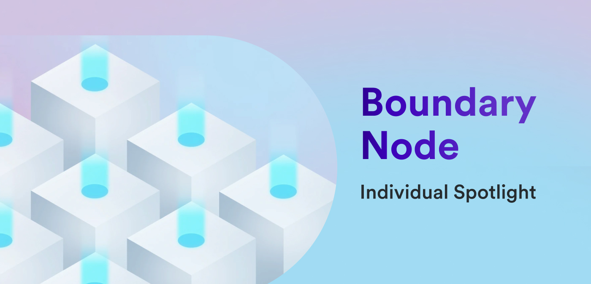

**Hello everyone, and welcome back to another edition of the individual spotlight series! In today's interview, we're chatting with Rüdiger, the team lead for the boundary node team, to learn more about what the boundary node team is working on and what challenges he faces as a team leader.**

**To kick things off, what projects or features does the boundary node team own and work on?**

*The boundary node team is in charge of the “edge” of the Internet Computer. Any request going to the Internet Computer is handled by code and infrastructure we are responsible for. At the moment, our biggest project is the new boundary node architecture. This entails a complete revamp of the services making up the “edge” and is a big undertaking. Besides that, we maintain the custom domains service and provide insights through logs and metrics to other teams.*

**We posted a [team spotlight interview for the boundary node team back in November](/blog/news-and-updates/team-spotlight-boundary-node) of last year. In that interview, we talked about the upcoming changes to the boundary node architecture. Could you give an update on that?**

*Yes, of course! We have made quite some progress. Since early June, we have had the first three API boundary nodes deployed in the mainnet. And just last week, we ran an HTTP gateway routing the requests to the API boundary nodes using the discovery library. This marked a big milestone for the team, as for the first time, we had all the components of the new boundary node architecture working together. Before we roll that out, we still have to get it ready for production. If you are interested, you can follow this [thread on the forum](https://forum.dfinity.org/t/boundary-node-roadmap/15562), where we try to regularly post updates.*

**As a team leader, how does your role differ from others on the team?**

*Since we are a relatively small team, I feel it doesn’t differ too much. I just serve as the first contact point for other teams and handle communication in the forum. Actually, the main difference comes from me being a researcher: I am more involved in the design of the new features and less in the implementation :)*

**Are there any unique challenges that you face as a team lead?**

*For me, the biggest challenge was and still is the transition from “just” being the researcher to also taking on the role as team leader. How we work as a team hasn’t changed much, but I personally feel a lot more responsibility. This year, we had a rough start with a few moments where the boundary nodes just received more traffic than they could handle. Right then, that was quite challenging, but looking back, it actually helped us improve our infrastructure and eliminate many performance bottlenecks.*

**What are some of the current challenges that the boundary node team faces?**

*The boundary nodes are a critical part of the IC infrastructure. The new boundary node architecture represents a major overhaul, and we really have to make sure that the transition happens as smoothly as possible. Ideally, it goes unnoticed, but for this, we need to do a lot of testing, have good monitoring set up, and make sure that the new components run reliably. Fortunately, we now have a good infrastructure in place that allows us to test new releases with real traffic from other DFINITY team members. So, I am confident that we will be able to roll out the new boundary nodes without major hiccups.*

**In addition to the boundary node architecture, what other projects are you currently working on?**

*Besides that, we are currently supporting the networking team in their work towards the [TOKAMAK milestone](https://internetcomputer.org/roadmap#Compute%20Platform-Tokamak), which is all about reducing end-to-end latency. Boundary nodes also contribute a significant part to user-perceived latency, as every request from a client has to go to a boundary node and from there to a replica node. To this end, we are extending the boundary nodes with the synchronous call endpoint and introducing geo-aware routing to reduce the network latency.*

*And we are working on SEV-SNP enabled HTTP gateways. This is still in the early stages, but ultimately, it would allow for trustless HTTP access to dapps hosted on the Internet Computer.*

**Those sound like very exciting projects that will have a huge impact on the network! In addition to these projects, what roadmap items from your team are you most excited about?**

*Actually, I am most excited about the smaller changes we have been and still are making behind the scenes to make our processes more automated, more robust, and simpler. This allows us to then focus more and more on the big roadmap items. The custom domains, for example, have come a long way since their launch in early 2023. Initially, we spent quite some time supporting developers setting up their domains. Now, we have lots of automation in place to guide them through the process, detect common mistakes early on, and debug issues.*

*Looking ahead, I am excited to finally roll out the new boundary node architecture. We have been working on it for quite a while, and it will be great when we see all the pieces coming together. After that, we will focus on making the access logs publicly available. This will be huge for IC devs as they will be able to drill down into every single request their canister received.*

**What roadmap item from another team are you most excited about?**

*Clearly, [BERYLLIUM](https://internetcomputer.org/roadmap#Developer%20Experience-Beryllium) from the execution and SDK team. We also developed and maintain a couple of canisters (e.g., for custom domains) and are excited about the developer experience improvements, especially the canister snapshots!*

**Are there any community projects or tools that you’ve been using recently?**

*I have to admit, I am a [taggr](https://taggr.link/) lurker. Also, I have been playing a bit here and there with [Juno](https://juno.build/).*

**To wrap things up, what’s your favorite thing about ICP?**

*You can host a website fully onchain. That’s amazing :) But that has been around for a long time. I guess what is awesome about ICP are all the different things one can do: HTTP outcalls, natively holding BTC, and now running AI models onchain.*

**Thanks so much, Rüdiger, for chatting with us today and providing some exciting updates on the boundary node team's projects and roadmap!**

**Be sure to tune in next time for another individual spotlight interview.**