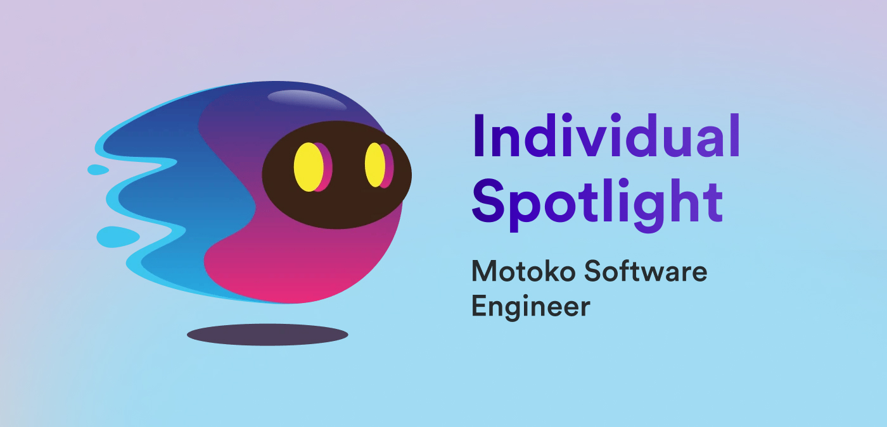

**Hello everyone, and welcome back to another edition of the individual spotlight series! In today's interview, we sat down with Ryan from the DFINITY Languages team, who are primary contributors to the Motoko programming language. The [Motoko 2024 roadmap](https://forum.dfinity.org/t/motoko-2024-roadmap/31912) was just recently announced on the developer forum, so there is no better time to dive into Motoko than in this week's issue!**

**Thanks so much for taking the time to chat with us today, Ryan. Let's start by talking about what projects or tools the Languages team has ownership of.**

*The main focus of the Languages team is Motoko, which is ICP’s native smart contract programming language. We also work on several other languages such as Candid and ic-repl along with IDE extensions and other development tools.*

**What makes the Languages team different from other teams at DFINITY?**

*Because Motoko is such an important foundation for all the applications built on top of it, we do our best to account for community feedback at all times. Through forum posts, monthly working group meetings, Developer Experience Feedback Board submissions, and the Motoko GitHub repository, we actively encourage feedback about Motoko so we can prioritize the highest-value language features.*

**Let's talk about the 2024 roadmap. What items are you most excited about?**

*Luc’s (another engineer on the team) “enhanced orthogonal persistence” feature is my top pick. As a quick overview of how this works, the idea is to change the memory layout of the language to massively increase the scalability and performance across canister upgrades (removing the distinction between “stable” and “flexible” variables). While this sounds like a low-level change, it’s a game-changer for applications which need to scale beyond the original 4GB main memory limitation, unlocking a much wider range of enterprise-grade applications which are feasible to build in Motoko.*

**What about the roadmap for other teams, are there any items you're excited about?**

*I’m very excited about the possibility of built-in support for WASI Preview 2 on the [Internet Computer](https://learn.internetcomputer.org/hc/en-us/articles/33152818663444-What-is-ICP). Being able to deploy WASI applications on ICP would be extremely powerful to the point where it becomes easy to forget that you’re developing on a blockchain. Beyond enabling support for many new programming languages, the Wasm Component Model (part of WASI 2) would make it possible to build canisters which use libraries written in multiple languages. An example use case is a Motoko actor being able to call functions from a Rust crate or TypeScript library.*

**Let’s talk about the EVM RPC canister, a project that you were a primary contributor to. What is the EVM RPC canister?**

*Right, so the EVM RPC canister is essentially a smart contract which makes it possible to interact with Ethereum and hundreds of other EVM blockchains in a secure, decentralized way. The goal is for ICP to become the go-to ecosystem for building cross-chain applications, and it’s clear that this is already happening given the popularity of the EVM RPC canister right now.*

**What makes the EVM RPC integration different from ICP’s native Bitcoin integration?**

*In contrast to ckBTC, which is more or less a Bitcoin node running directly on the Internet Computer, the EVM RPC canister uses consensus between multiple JSON-RPC APIs. This is fully customizable; you can decrease the number of RPC providers to reduce the cost per call, or you can even add your own custom API endpoints for a specific use case or brand-new EVM network.*

**Since the Bitcoin integration is a direct node integration with BTC, the EVM RPC canister might sound as if it acts like a bridge, even though under the hood it doesn't. How does the EVM RPC canister differ from a bridge or oracle?**

*A major advantage of ICP—which makes the EVM RPC canister possible—is the ability to perform HTTPS outcalls. Instead of using an expensive oracle, you can simply send a standard HTTP request which is processed by each node in your canister’s subnet. The protocol handles consensus so that you don’t need to trust any individual nodes sending these requests.*

*While this is a highly useful feature for the EVM RPC canister, it’s also relatively simple to use this in any ICP application! If you Google “icp https outcalls” or ask the AI chatbot on internetcomputer.org, you’ll find lots of good documentation on how to get started with this feature.*

**What are the possibilities that the EVM RPC canister unlocks for developers?**

*Oh, don’t even get me started. Beyond making it possible to move value between chains through projects such as ckETH and ckUSDC, it’s also possible to run low-cost smart contract computations using EVM assets which would otherwise be at least 10 or 100 times more expensive on their original network. Furthermore, if you wanted to launch your own EVM-based blockchain, the EVM RPC canister is by far the simplest way to connect your network to the broader Web3 ecosystem.*

**What design choices were made regarding the format and functionality of the EVM RPC canister?**

*The main design challenge was to find a good compromise between decentralization and reliability. While the canister is governed by the NNS, we also wanted a way to be able to quickly respond to disruptions in availability. Currently, DFINITY has the ability to perform maintenance actions such as replacing API keys for RPC providers. Everything else is decentralized and subject to a voting process via NNS proposals.*

**Was there any developer feedback that was used to either revise or make additions to the EVM RPC canister?**

*You know it! The biggest community feature request was to simplify calling Ethereum Layer 2 (L2) networks, which we recently included as part of the official launch of the canister. We also made several revisions to the Candid interface and fixed user-reported bugs during the beta testing phase prior to launch.*

**Now that the EVM RPC canister has been launched, what projects are you currently working on?**

*My current focus is exploring how we could use the WebAssembly Component Model to provide cross-language interoperability between Motoko and other languages such as Rust and TypeScript.*

*This is primarily based on community feedback! One of the most highly requested features for Motoko is the ability to use libraries (“crates”) from the Rust ecosystem. With the current momentum towards supporting WASI 2 in the replica, we are getting much closer to being able to support cross-language functionality within a single ICP canister.*

*Even if you’re unfamiliar with Rust, this feature will greatly expand the available package ecosystem and ultimately gives you more problem-solving flexibility as an ICP developer.*

**What advice would you give a new developer getting started on ICP?**

*From having originally been part of the ICP community before working at DFINITY, I would encourage starting small and learning one thing at a time. The Internet Computer is a huge, complex protocol, but I assure you that once you understand the basics, everything else will start falling into place and you’ll be able to tackle much more ambitious projects.*

*If you’re already familiar with traditional web development, writing a frontend canister is a great way to get started with familiar technologies (JS/TS, HTML, CSS, etc.) while also learning how to deploy and upgrade ICP canisters using dfx.*

**Are there any community projects or tools that you’ve been using recently? If so, how do they impact things that you’re working on?**

*The Mops package manager for Motoko is a great community project which is used internally at DFINITY. I’ve also recently used a nifty community project called ic-reactor, which makes it simple to perform canister calls from a React frontend.*

**Thanks so much for chatting with us today Ryan, this was great! To wrap things up, what is your favorite thing about ICP?**

*The upside potential of the token price! Just kidding. What I love about ICP is that it’s a solid, well-established, and incredibly impressive technical solution to many of the biggest problems with the centralized Internet. From my time working here, I can say that DFINITY is truly an iceberg of extremely talented people working towards a common goal of making the idealized vision of Web3 into a practical reality.*

**Thanks again Ryan for an incredible chat about Motoko and the EVM RPC canister! Be sure to tune in next time for another individual spotlight interview.**

