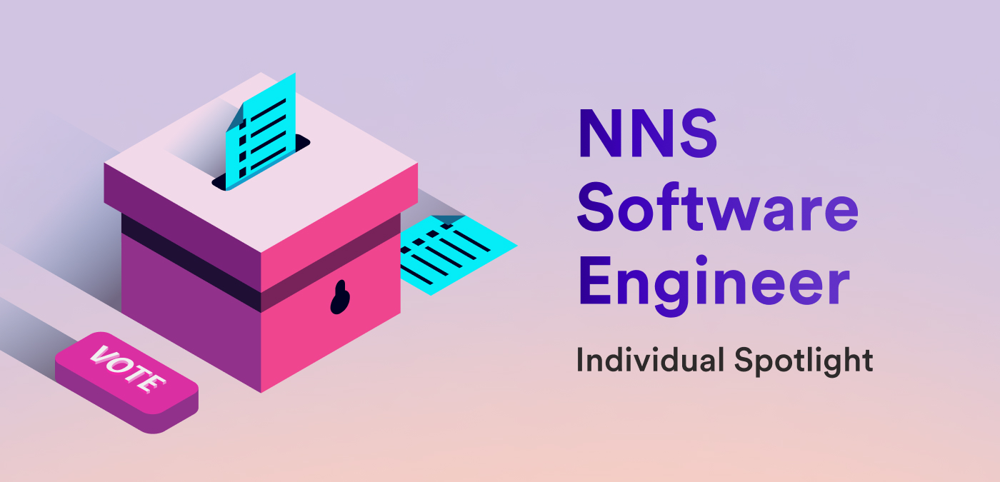

**Hello everyone, and welcome back to another edition of the individual spotlight series! In today's interview, we sat down with Andre from the Network Nervous System (NNS) team, who develop the NNS and the NNS dapp. The NNS is ICP's governing body that facilitates updates or changes to the network through community voting on proposals.**

**To get started, could you describe what tools, projects, or features your team primarily works on or has ownership of?**

*We develop the NNS, which manages the entire Internet Computer, as well as the SNS toolkit, currently used by 25 different teams outside of DFINITY. Additionally, we work on the NNS dapp, which serves as the community’s portal to all these DAOs.*

**What makes the NNS team different from other teams at DFINITY?**

*We are one of the few teams at DFINITY that uses the ICP from the perspective of an ICP developer, building canisters using DFINITY tooling. This unique position allows us to provide valuable feedback to other teams about features that would benefit ICP developers. We simultaneously develop the NNS, which manages the Internet Computer itself, and the SNS, which is a toolkit used by many external teams to manage their own projects.*

**For those that may not be familiar with ICP, what is the NNS and what role does it play on the network?**

*The NNS is a DAO that is central to the Internet Computer. When there is a need to upgrade the code of the Internet Computer, it must be done through an NNS proposal. Once such a proposal is executed, the nodes automatically begin using the new version. This principle also applies to other governance matters, such as voting on new node providers and allocating nodes to subnets. The NNS is recognized as the most advanced DAO in the world. A few years ago, it was realized that the structure of the NNS could manage not just the ICP but anything. Hence, the SNS was created as a mini-NNS with its own token to manage various decentralized applications (dapps), with all decisions made by its community. An SNS decentralization swap starts with an NNS proposal to create a new SNS, allowing users to exchange their ICP for a neuron within that SNS.*

**How can the community interact with the NNS?**

*The easiest way is to use the NNS dapp, available at https://nns.ic0.app/. Like all dapps on ICP, this is backed by chain-key cryptography, which guarantees that what you see on the website reflects the true state of the Internet Computer, and is implemented as an unpermissioned frontend (meaning there is no code in the NNS that gives the NNS dapp special privileges in any way).*

*Using the NNS dapp, users can send and receive ICP, stake it to form neurons, and vote on proposals. You can even send and receive wrapped versions of Bitcoin, Ethereum, and USDC (trustlessly bridged to ICP). This makes the NNS dapp a great tool for anyone interested in ICP or crypto more generally.*

*Of course, the users of the NNS are likely to also be interested in the SNSes, so the NNS dapp also has great support for SNSes. Users can participate in SNS launches, send and receive SNS tokens, form SNS neurons, and vote on SNS proposals, all controlled by a single Internet Identity through a unified interface.*

*Another great option is through the ICP dashboard, available at https://dashboard.internetcomputer.org/. The homepage gives lots of information about the state of the Internet Computer, as well as allowing users to easily make canister calls to any SNS without being logged in. I personally use this all the time when an SNS community member posts a question on the forum that I can help with by doing something like checking their SNS settings. Of course, there are also CLI tools like `dfx` and Quill that can be used to interact with canisters on the Internet Computer including NNS and SNS canisters.*

**Those are all great options; it seems we have a workflow for all different use cases and types of users. For new users, however, all those options might be overwhelming. How would you recommend someone new to ICP get started participating in the NNS?**

*Interested users should make an account with the NNS dapp, send some ICP to it, and stake a neuron with a dissolve delay of at least 6 months. This will cause them to start earning maturity on their neuron after a few days, which can then be spawned into ICP.*

*In addition, they will then be able to vote on any open proposals created after they create their neuron. While I personally believe that voting on NNS proposals is its own reward, NNS users also receive voting rewards proportional to how often they vote.*

*If they want, they can also join the Neurons’ Fund. This is another use of the maturity of a neuron; some SNSes request Neurons’ Fund participation, which means that the maturity of eligible NNS neurons will be used to contribute to their decentralization sale. In exchange, those neurons are allocated an SNS neuron, which can be used to vote on and submit proposals for that SNS. All SNSes can only be created via the adoption of an NNS proposal, but if there is an SNS being proposed that they don’t like, they can always withdraw from the Neurons’ Fund.*

**You mentioned that updates to the code of ICP are done through NNS proposals. If a community member wants to propose a change or add a feature, how can they make their voice heard?**

*The first step would be to post on the forum explaining your point of view. After that, large changes are usually preceded by a motion proposal on the NNS, which is a special type of proposal that has no direct behavior on adoption but is used to find out if the majority of the community agrees with the motion. Then, the relevant team at DFINITY or elsewhere may implement the change and propose it to the NNS governance participants.*

**Let's go back to SNSes on ICP. What is special about the ability to create an SNS?**

*A DAO is a somewhat nonspecific term, and users by default can’t assume that a particular DAO has a particular behavior. Meanwhile, all SNSes are based on code that has been approved by the NNS governance participants, which means that they all share the same fundamental principles of operation, and they all have had their code audited by the same community that audits every change to the ICP itself.*

**Of the current SNSes launched on ICP, which one is your personal favorite and why?**

*I have a sentimental attachment to OpenChat as the OpenChat SNS launch was the moment when I felt like our work on the SNS had truly proven itself. Its launch involved millions of dollars worth of ICP being handled by our code and the decentralization of one of the largest dapps on ICP.*

**Looking ahead at the features planned for the NNS this year, what roadmap items are you most excited about?**

*I mostly work on the SNS, so roadmap items related to the SNS are the most exciting to me. My personal favorite is the “SNS Toolbox” item. Most of our work on the NNS and SNS involves developing the NNS and SNS themselves, but up soon on our list is to really focus on every other part of the experience, in particular the tools that users and developers use to understand and interact with them.*

**What roadmap item from another team are you most excited about?**

*I love the “best effort canister responses” feature. This is a somewhat technical feature, but the short version is that when one canister calls another, there is currently no inherent limit to the time that the caller will wait for the callee to respond. I think this is a good default, but there are cases where you want the caller to time out and abandon its call if the callee is taking a very long time to respond. The NNS is designed to be resilient to even very unlikely and exotic attacks, like a malicious subnet, and this feature will allow us to simplify a lot of our code that handles cases like that.*

**Let's talk about your personal focus. What projects are you currently working on?**

*Right now, I’m working on transferring the Neurons’ Fund participants’ hotkeys to their SNS neurons for future SNSes.*

*The owner of large neurons depends on the ability to keep the key for their neuron in cold storage, but they allocate “hotkeys” which are keys that have fewer permissions than their main key, which they can keep less secure. The benefit of this is that accidentally having a hotkey stolen or hacked doesn’t give the thief the ability to steal the ICP locked inside the neuron. Instead, the worst they can do is use the hotkey to vote on and submit proposals.*

*As I mentioned earlier, neurons can join the Neurons’ Fund, which means they may get an SNS neuron for each new SNS that is created while they’re in the fund. The issue is that your NNS neurons’ hotkeys are not automatically added to the SNS neuron you get for being part of the Neurons’ Fund. This means that they must go get their neuron’s “master key” out of cold storage and use it to set up hotkeys for their SNS neuron. We want to avoid putting them through this inconvenience, so our plan is to have the SNS automatically copy the hotkeys over when it gives the Neurons’ Fund participants their NNS neurons.*

**That sounds like a great feature that will enhance the Neurons' Fund experience.**

**It was great learning so much about the NNS in this conversation; thanks, Andre, for chatting with us! To wrap things up, what’s your favorite thing about ICP?**

*Of course I’m biased by being on the NNS team, but I think the tokenomics of ICP in relation to governance and neurons is very cool. Many DAOs have less sophisticated tokenomics, where anyone who holds that DAO’s token can vote. The issue is that you may find yourself incentivized to vote for the short-term benefit of the token at the cost of the long-term benefit. The NNS and SNS, on the other hand, only allow you to vote when you’ve locked your tokens in a neuron for a minimum staking period (six months in the NNS) and give you additional voting power for the longer you have your tokens locked for. This naturally reduces the incentive to consider only the short term when voting. To be honest, I even wonder if companies could structure their share-based voting system to work in a similar way. Since SNSes work this way, I think this gives an inherent advantage to projects managed via the SNS over other projects with worse voting incentives.*

**Thanks again, Andre from the NNS team, for providing such great insight into the NNS for us! Be sure to tune in next time for another individual spotlight interview!**
