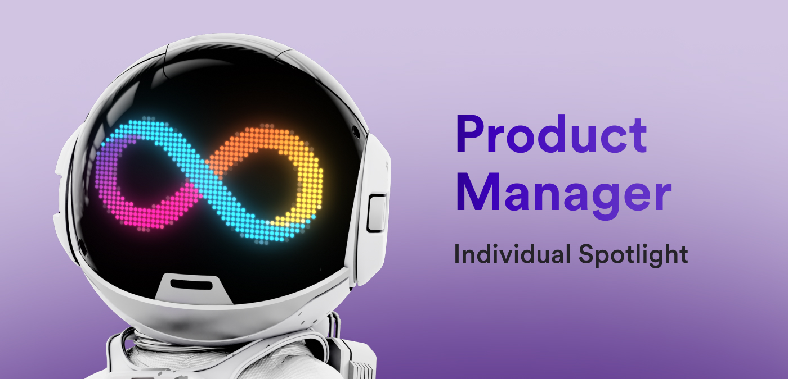

**Hello everyone, and welcome back to another edition of the individual spotlight series! In today's interview, we're chatting with Andrew, a product manager who is dedicated to growing and refining the Internet Computer as a product. To learn more about what that means, we sat down and asked more about Andrew's day-to-day workflow.**

**To get started, what tools, projects, or features does your team primarily work on?**

*While I work in the product team, my focus is mostly centered around the NNS, so I work very closely with the NNS team, whose responsibility is proposing continuous improvements to the NNS, SNS, and NNS dapp.*

**What makes your role at DFINITY unique?**

*Having had different roles at DFINITY, my work has always been very versatile and exciting. These days, I help shape the NNS dapp roadmap, and work closely with design and engineering to define new features and prioritize requests from the community while executing on our own vision for the NNS dapp.*

*Maybe a bit less traditional, but my role also includes a fair bit of public communication — proposing new features on the forum, answering questions or taking requests, helping with two YouTube series (ICP Developer Liftoff & NNS Explained), advising teams building on ICP, and occasionally speaking at events.*

**As a product manager, you interface with several different teams on different initiatives. What is one recent initiative that you were a part of?**

*We recently started an initiative to motivate the ICP community to verify proposals and vote manually. Part of this initiative led by Lara Schmid, I am responsible for editing all episodes [of the YouTube series] as well as recording some [content] related to the NNS dapp and staking. If you’re interested, check out the series [here](https://www.youtube.com/playlist?list=PLuhDt1vhGcrclxfmztDd6OKE80dnrFmG6).*

**As you mentioned, you also contribute to the different video series on the DFINITY YouTube channel, such as the NNS Explained and Developer Liftoff videos. What impact do these videos have on the community?**

*These two series have different, but slightly overlapping, target audiences. That said, I’m equally excited about them — I believe they are very important to the ecosystem, and both are series I wish existed back when I started my journey in ICP land.*

*[Developer Liftoff](https://www.youtube.com/watch?v=oBUpJ4CqmN0&list=PLuhDt1vhGcrdR2h6nPNylXKS4u8L-efvD&ab_channel=DFINITY) is a complete developer tutorial series that takes a dev who hasn’t heard of ICP all the way to the point of being able to develop a wide variety of canisters with a general understanding of most of ICP’s unique capabilities.*

*[NNS Explained](https://www.youtube.com/watch?v=1uX-fRgvXjU&list=PLuhDt1vhGcrclxfmztDd6OKE80dnrFmG6&ab_channel=DFINITY) is a much needed series that explains many aspects of the NNS from how to stake ICP to how neuron following works to manually upgrade proposals.*

*Both series serve as a one-stop-shop for newcomers (as well as OGs) to get a fundamental understanding of important ICP concepts they can deepen later.*

**It sounds like a lot of your work has a direct impact on the community by providing more educational resources for them to reference. Are there any other ways your role as a product manager interfaces with the developer community? **

*I used to work very closely with the developer community, but even now, I’m involved in different initiatives that reach our developer community one way or another.*

*Some developer teams reach out to me to review their product or give advice. I’ve become a bit slower in responding, but I try to never say no. Some SNS teams make direct feature requests on the forum that I then try to incorporate into our roadmaps if possible.*

*Besides that, I work with the Growth and SDK teams on content for the DFINITY Developers X account (although less involved now than in the past), and edit videos that are targeted at developers.*

**What advice would you give to developers looking to get started on ICP?**

*For beginners, go through the Developer Liftoff series and start building something. First, build something simple that still uses ICP’s features, like a TODO dapp. You can add Internet Identity sign-in, you will need to use update calls to write to canister memory, and so on — all things that a more complex dapp will also use. You should also play around with sample projects; there is no need to develop everything from scratch.*

*For experienced developers, my advice is a bit different; don’t build something cool because it uses interesting technology that you enjoy using. Build something that solves a real world problem other dapps/apps don’t solve, and work your way back to picking the technology you need to use to solve that problem. What is the dapp that doesn’t exist but should?*

**You mentioned being a primary contributor to the NNS roadmap. What roadmap items for the NNS are you most excited about?**

*Two come to mind: [The] Neurons table that provides a much better overview of one’s neurons across all SNS DAOs, and importing custom ICRC tokens. I see both having a very positive impact on user experience. I’m personally excited to be using both.*

**What roadmap item from another team are you most excited about?**

*We are getting closer and closer to achieving a big milestone that involves different parts of the protocol, and will greatly reduce end-to-end latency for ICP. This should make all ICP dapps feel snappier without developers having to change anything.*

**Let’s talk about the SNS communities that exist through the NNS dapp. Which SNS community is your personal favorite and why?**

*This is a tricky one. A few weeks ago, I would have said OpenChat, as that is the ICP dapp that I use the most besides ICPSwap. However, since then, WaterNeuron has launched their SNS, which is one of the most exciting recent SNS launches. I’m really excited to see all three of these projects evolve.*

*If I have to pick just one, it’s probably OpenChat. They have been delivering great features non-stop for several years now. Their dapp is reliable, easy to use, quick, and keeps getting more cool features.*

**To wrap things up, what’s your favorite thing about ICP?**

*Hmmmm… It’s hard to pick. ICP has many unique features not seen in other blockchains that allow it to be this infinitely scalable full-stack decentralized cloud. But if I have to pick just one, I will say SNS. Not necessarily just the DAO framework itself, but the whole stack. An SNS DAO is the combination of many ICP features that make these DAOs very unique in the crypto landscape. They are in fact the only DAOs that I know of that allow full decentralization.*

*What I mean by that is that every component of an SNS DAO can be decentralized and controlled by its community, including the frontend, backend, and data. SNS DAOs don’t need to rely on AWS to serve frontend or host data. This is important because in other DAOs, developers still have a lot of centralized control over many components of software, with the exception of the smart contracts.*

**Thanks again, Andrew, for providing such great insight into your unique role at DFINITY for us! Be sure to tune in next time for another individual spotlight interview!**

