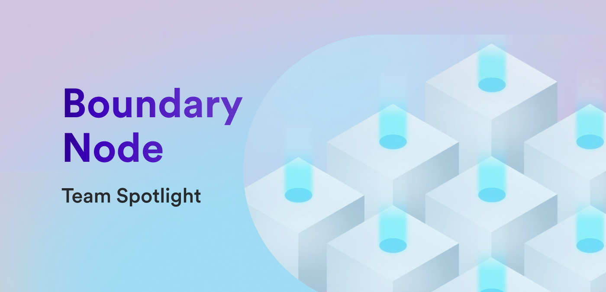

**Hello everyone and welcome to this edition of the team spotlight series! In this interview, we sat down with the Boundary Node team to talk about what role the ICP boundary nodes play on the network, what functionalities they provide, and how developers benefit from their unique attributes.**

**For our usual introduction to the team, what would you say the purpose of the Boundary Node team is?**

*[The purpose of the Boundary Node team is] to provide seamless and reliable access to the Internet Computer.*

**What is the composition of the Boundary Node team?**

*We are a team of five: four engineers and a research scientist who doubles as a team lead.*

**Developers may not be familiar with boundary nodes on ICP, so to provide some context, what is a boundary node? What purpose does a boundary node serve on ICP?**

*The boundary nodes are the gateway to the Internet Computer. Every single request going to the Internet Computer first reaches one of the boundary nodes. The boundary node routes that request to a replica node in the right subnet, where the target canister is hosted. [Additionally], the boundary nodes improve the user experience by forming a caching layer for the Internet Computer and provide a first layer of protection by applying rate-limits on certain requests.*

*For more details on the internals of a boundary nodes, take a look at [the wiki page](https://wiki.internetcomputer.org/wiki/Boundary_Nodes).*

**How do boundary nodes communicate with ICP subnets?**

*There are mainly two ways in which the boundary nodes interact with ICP:*

- *First, the boundary nodes need to fetch all the routing information from the registry in the NNS subnet. This information includes a mapping of canisters to the corresponding subnets and a mapping of subnets to the replica nodes, which they are composed of.*

- *Second, the boundary nodes send all the incoming requests to replicas in the correct subnets, wait for the response and pass it on to the client that originated the request.*

**Are there different types of boundary nodes?**

*At the moment, there is one type of boundary node that serves two functions: first, it provides the API endpoints according to the [interface specification](/references/ic-interface-spec#http-interface) (e.g., /api/v2/status), and second, it provides the HTTPS endpoints for browsers to directly interface with the canisters hosted on ICP (cf. [HTTP gateway protocol specification](/references/http-gateway-protocol-spec)). In the very near future, the boundary nodes will be split into two different entities or types: API boundary nodes and HTTPS gateways.*

**By acting as the gateway to ICP, what additional functionalities do boundary nodes provide to the rest of the network?**

*The API boundary nodes will serve the API endpoints. They simply route the call to the right replica node. The HTTPS gateways translate the browser requests into ICP API calls and forward them to one of the API boundary nodes. In addition, the HTTPS gateways will provide caching of static assets in order to improve the user experience.*

**Since the boundary nodes provide such an important core piece of the Internet Computer, I can imagine that there are several different teams that the Boundary Node team works with. What are some of those teams?**

*We work closest with the Trust team, which is currently working on the service worker (one implementation of the HTTP gateway protocol). The service worker is hosted by the boundary nodes and served from them. Together, we have to coordinate the releases of new boundary node and service worker versions.*

*In addition, we also regularly interface with Platform Ops, who provide the hardware on which the boundary nodes run and the Node team, which is responsible for the base layer of the boundary nodes’ operating system.*

**Since developers don't directly interact with the boundary nodes, is there anything that developers should know about them to enhance or improve their workflow?**

*Ideally, the developers should know the boundary nodes exist, but should not have to worry about them. That means we are doing our job by seamlessly and reliably providing access to their dapps hosted on ICP.*

*But maybe one thing we would like developers to be aware of is our custom domains feature, which allows developers to host their dapp under their own domain without the need for any additional infrastructure. For more information, you can check the respective [developer docs](/building-apps/frontends/custom-domains/using-custom-domains).*

**What is unique about the ICP boundary nodes in comparison to how other chains provide a gateway to their network?**

*The IC’s unique capability to serve web content directly from canister smart contracts is only possible thanks to the HTTP gateway protocol and the boundary nodes that implement it. This allows users to access dapps directly in their standard browser without having to install any special software (e.g., specific browser or browser plugin).*

**What’s the biggest challenge the Boundary Node team has faced?**

*We have faced many challenges so far: we worked hard on automating processes and stabilizing the nodes, we enabled developers to set up already over 300 custom domains for their canisters. However, the biggest challenge is yet to come as we are working on the new boundary architecture that splits today’s boundary nodes into API boundary nodes and HTTPS gateways.*

**What is the primary project that the Boundary Node team is working on or focused on currently?**

Our main focus is currently on the new boundary node architecture.

**What are the primary components of this project?**

*This project can be broken down into four main pieces or milestones:*

*1. Building `ic-boundary`, a custom router for API calls, which will be the core of the upcoming API boundary nodes.*

*2. Putting the API boundary nodes under the management of the NNS.*

*3. Building an API boundary node discovery library that helps ICP clients (e.g., an HTTP gateway or a native application) to discover all existing API boundary nodes and route their traffic to them.*

*4. Building the HTTP gateway.*

**What are the primary benefits that developers will be able to observe from the completion of this project?**

*The new architecture fully decentralizes the access to ICP and opens the doors for many additional gateways next to the HTTP gateway (e.g., a Websocket gateway, a DNS gateway, etc.).*

**When can developers expect the project to be completed?**

*The project is currently going in full swing. We have completed the main work on `ic-boundary` and have deployed it to the existing boundary nodes for about a week now. Currently, we are working on everything that is required to put the API boundary nodes under the management of the NNS and to build the discovery library. These two topics will keep the team busy until early 2024. Alongside, we will slowly be starting to work on the HTTP gateway.*

**Where should developers look for the latest Boundary Node updates?**

*We regularly post updates on the forum. In addition, we are actively monitoring Discord. If you have any questions or feedback just reach out to us on either platform.*

**What is one feature or aspect of ICP’s boundary nodes that the team is the most proud of?**

*`ic-boundary`! We are very proud of our new API call router that replaces a combination of services and custom modules centered around nginx. It is more performant and way simpler to extend and maintain.*

**To wrap things up, what makes the Boundary Node team unique compared to some of the other teams at DFINITY?**

*Every couple of weeks, we have a meeting titled “Most important meeting of our lives” during which we take a break and just play some games together. Those are indeed very important meetings for our team spirit. 🙂*

A huge thank you to the Boundary Node team for sitting down with us today to provide an insightful look into what ICP boundary nodes are and what role they play on the network! Be sure to tune in for the next edition of team spotlight, which will focus on the languages team and dive into all things Motoko!

-DFINITY
