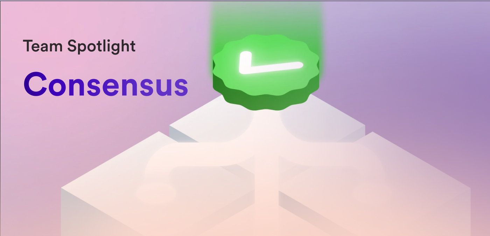

Hello everyone and welcome to another installment of the DFINITY team spotlight! For this issue, we're going to be taking a deep dive into the team behind one of the most important, fundamental components of any blockchain platform: the consensus protocol. What is a consensus protocol, and how does consensus on the Internet Computer happen? Let's find out!

**To get started, on a fundamental level, what is consensus?**

*[The ICP uses replication] to enable a secure and trustless computation on independently owned and controlled hardware resources (they are called "replicas"). The consensus layer of ICP is responsible for coordination of these replicas by making them agree on inputs to be processed, their order, and on the obtained computational results. By assuming that strictly less than ⅓ of these replicas are malicious or faulty, we can achieve the Byzantine Fault Tolerance on ICP meaning that the system is able operate even if some of its replicas fail or act maliciously.*

**Does the consensus team only focus on the consensus layer, or are there other responsibilities of the consensus team?**

*We own the consensus layer of the ICP stack, develop the node/topology orchestration software and are responsible for DKG (distributed key generation) and t-ECDSAA orchestration.*

**What is the composition of the Consensus team?**

*We have 5 engineers based in Zurich, 1 engineer in Singapore, 1 research lead in the US and 1 team lead in Zurich.*

**Let's dive a bit further into the ICP consensus protocol. Could you explain how the ICP consensus protocol works?**

*[The] ICP consists of multiple subnets which in turn consist of replicas mentioned above. Moreover, each subnet is hosting canisters (user deployed software). When these canisters receive messages, the subnet hosting them needs to achieve consensus among its replicas on a subset and [the] order of messages to be passed to the canisters. The ICP consensus protocol works in rounds. In each round replicas agree on a block containing a set of messages to be processed next. This block extends a chain of blocks with previous messages. Blocks are proposed by replicas elected as block makers. Then, every replica tries to validate the proposed block and if the super majority (⅔ of nodes) agrees on one single valid block in a round, the messages from this block get executed. However, if multiple valid blocks are valid (this could happen during sub-optimal network conditions between replicas), the subnet keeps building new blocks until a round is reached where only one block is valid.*

**Developers may be familiar with the consensus mechanisms of other blockchains, such as Ethereum or Bitcoin. How is consensus on ICP different from other blockchains?**

*[The] ICP consensus is very different from both Bitcoin and Ethereum. For example, it cannot be classified as proof of work or proof of stake. We call it "proof of useful work" meaning that nodes need to constantly contribute to subnets computation to not get slashed. Moreover, nodes are not anonymous and are appointed by the NNS DAO. Having a high finality time and multiple subnets running their own consensus we need to maintain a realistic scalability approach and hence all subnets regularly trim their blockchains and delete old blocks. In order to allow new nodes to join a subnet, we came up with the catch-up package mechanism. Moreover, the protocol can be upgraded with a granularity of a subnet level. Subnets get upgraded via NNS proposals.*

**Consensus is a core piece of ICP, but it's one aspect that developers may not be aware of how it is directly benefiting them. How do developers benefit from consensus on ICP?**

*Consensus is what enables the replication of computation on ICP, giving the security and fault tolerance. That security means that the life is much simpler for developers: they just deploy their code and don't need to worry about anything else like infrastructure for security, e.g. firewalls or reverse proxies and so on. The only aspect of the consensus visible to the end users of ICP (developers and dapp users) is the latency of write requests. Most of our application subnets have a high finality rate, so that the end to end latency for write requests can be as low as ~2.8 seconds. While it might be impractical for some applications requiring real-time data processing, it has proven itself to be sufficiently fast for a whole set of applications like messengers, social networks and many other CRUD like applications. Such low latency can be easily hidden behind UI patterns like optimistic updates, especially because the same patterns are applied today on most internet-scale Web2 applications where the transaction settlement often has a latency of the same order of magnitude.*

**It sounds like consensus definitely contributes to the developer experience! In contrast to developers and end users who don't interact directly with the consensus layer, nodes and node providers directly interact with consensus. Could you give us a bit more insight into how nodes participate in consensus?**

*Once a node registers itself with ICP and gets assigned to a subnet, it pulls a catch-up package we mentioned above. This catch-up package is signed by the subnet and can be verified against the subnet's public key. It also contains a reference to a state which has to be pulled from node's peers. Once the node has the state available locally and all new finalized blocks, it can start participating in the consensus by creating and validating new blocks.*

**If a node doesn’t act honestly during consensus, what happens to it?**

*The NNS can remove nodes if they misbehave. Currently, this decision would be based on observations and metrics. But we're currently working on collecting deterministic metrics from a subnet allowing us to verify node's contributions to the subnets computation. The next step would be to use these metrics for penalizing those nodes which are not behaving according to the protocol rules.*

**Let's talk about the Consensus team's roadmap. What is the primary project that the Consensus team is working on or focused on currently?**

*We're currently focused on improving the ECDSA throughput and latency performance which is needed for the upcoming Ethereum integration.*

**What are the primary benefits of this project?**

*After the Ethereum integration is completed, we hopefully will have a lot of "twin tokens" of many popular ERC20 tokens on ICP. To "bridge" this token between ICP and Ethereum, a lot of ECDSA signatures will be required, so it would be very beneficial for the user experience if the waiting times for bridging an asset are as low as possible.*

**When can we expect the project to be completed?**

*By the end of 2023.*

**The Ethereum integration is extremely exciting, and I'm eager to see what it unlocks for developers! Where should developers look for the latest Consensus updates? (Forum, Discord, etc).**

*The definite source of truth would be the change logs that can be found in the upgrade proposals.*

**To wrap things up, what is one feature or aspect of the ICP consensus protocol that the team is the most proud of?**

*The current consensus protocol powers a lot of dapps on ICP already and many of them are working as fast as their centralized counterparts.*

A big thank you to the Consensus team for sitting down with us and chatting all things consensus protocol! That'll wrap things up for this issue of team spotlight, thanks for checking in!

-DFINITY
